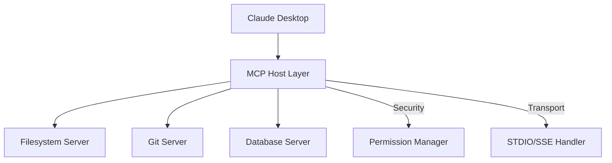

# Chapter 1: Introduction to Model Context Protocol

## Overview

The Model Context Protocol (MCP) represents the most significant advancement in AI tooling since the introduction of APIs themselves. This chapter introduces the fundamental architecture, security evolution, and rapid maturation of the MCP ecosystem as of November 2025. We'll explore why MCP solves the critical "NxM problem" that has plagued AI integration for years and understand the architectural components that make it the definitive standard for agentic AI applications.

---

## 1. The Universal Adapter: Solving the NxM Integration Problem

### The Fragmentation Crisis

Prior to MCP's emergence in late 2024, developers faced what industry analysts termed the **"NxM problem"**:

- **N models** (GPT-4, Claude, Llama, local models) each required 
- **M tools** (databases, APIs, file systems, browsers) resulting in
- **N×M integration nightmares** with bespoke "glue code"

Every new AI model needed custom wrappers for every external tool. A developer wanting to connect Claude to PostgreSQL, GitHub, and a local filesystem would write three separate integration layers, each fragile and model-specific.

### The Universal Connector Solution

MCP standardizes the interface between three components:

```json
{
  "conceptual_flow": {
    "client": "AI User Interface (Claude Desktop, Cursor, VS Code)",
    "protocol": "Model Context Protocol (JSON-RPC over stdio/SSE)", 
    "server": "Tool Provider (Database, Browser, Filesystem)"
  }
}
```

**The breakthrough**: A single server implementation serves **any MCP-compliant client** without modification. The `mcp-server-sqlite` works identically with Claude Desktop, Cursor, or a custom application because both speak the same protocol.

### Market Impact Assessment

| Metric | Pre-MCP Era | Post-MCP (Nov 2025) |
|--------|-------------|-------------------|
| **Integration effort** | 2-3 weeks per tool | 30 minutes configuration |
| **Code maintenance** | Custom patches per model | Single server update |
| **Security model** | Ad-hoc per implementation | Standardized capability system |
| **Vendor lock-in** | High (client-specific tools) | Low (protocol standard) |

---

## 2. Architecture Fundamentals: Client-Host-Server Topology

### The Tripartite Model

MCP's architecture deliberately separates concerns to enable security, flexibility, and privacy:

#### Client Layer
- **Responsibility**: User interface and experience management
- **Examples**: Claude Desktop, Cursor, VS Code, LibreChat
- **Key function**: Translates user intent to MCP protocol messages

#### Host/Transport Layer  
- **Responsibility**: Connection lifecycle and permission management
- **Transports**: Standard Input/Output (stdio) and Server-Sent Events (SSE)
- **Security role**: Enforces "Human-in-the-Loop" approvals for sensitive operations

#### Server Layer
- **Responsibility**: Exposes specific capabilities as Tools, Resources, and Prompts
- **Isolation**: Each server runs independently with its own security sandbox
- **Capability types**: 
  - **Tools**: Executable functions (e.g., `write_file`, `execute_query`)
  - **Resources**: Passive data sources (e.g., files, database schemas)  
  - **Prompts**: Pre-defined interaction templates



---

## 3. Transport Mechanisms: Choosing Between Stdio and SSE

### Standard Input/Output (Stdio)
**Primary use**: Desktop development, local resource access
**Advantages**:
- Zero network configuration required
- Inherits user's local environment naturally  
- Minimal attack surface (no open ports)
- Maximum privacy for sensitive data

**Configuration pattern**:
```json
{
  "filesystem": {
    "command": "npx",
    "args": ["-y", "@modelcontextprotocol/server-filesystem", "~/projects"]
  }
}
```

### Server-Sent Events (SSE) over HTTP
**Primary use**: Remote resources, team sharing, enterprise deployments
**Advantages**:
- Asynchronous push capabilities
- Shared resource access across multiple clients
- Suitable for Docker/Kubernetes deployments
- Cross-network connectivity

**Configuration pattern**:
```json
{
  "postgres": {
    "command": "npx",
    "args": ["-y", "@modelcontextprotocol/server-postgres", "postgresql://localhost:5432/mydb"]
  }
}
```

---

## 4. Security Evolution: From Unchecked Access to Capability-Based Permissions

### The Early Security Crisis

Initial agentic tools suffered from **over-permission vulnerabilities**:
- Unlimited filesystem access risking system file exposure
- Unrestricted shell command execution  
- Database connections with full DML/DLL privileges
- No audit trails or usage monitoring

This led to multiple documented security incidents in early 2025, prompting a fundamental redesign of the MCP security model.

### The Capability-Based Security Model

#### Roots and Sandboxing
The modern MCP specification implements **capability-based security**:
1. **Explicit permission granting** at configuration time
2. **Scope-limited operations** within defined boundaries
3. **Human approval** for high-risk actions
4. **Audit logging** for forensic analysis

#### Security Tiers by Server Type

| Risk Level | Server Examples | Security Controls | Approval Pattern |
|------------|----------------|-------------------|------------------|
| **Critical** | Shell, Database | Command allowlists, read-only defaults | Always require approval |
| **High** | Filesystem, Git | Path restrictions, read-write separation | Ask first time, remember preference |
| **Medium** | Browser automation | Domain allowlists, time limits | Default approve, revoke on suspicion |
| **Low** | Search, Documentation | API rate limiting, content filtering | Automatic approval |

---

## 5. The 2025 Ecosystem: From Experimental to Production-Ready

### Maturation Indicators

The MCP ecosystem has transitioned from experimental proof-of-concepts to enterprise-grade infrastructure:

#### Official Reference Servers
- **Maintenance**: Weekly security patches, monthly feature releases
- **Quality**: Comprehensive test suites, formal security audits  
- **Documentation**: API docs, configuration guides, troubleshooting FAQs
- **Community**: Active Discord, GitHub discussions, Stack Overflow presence

#### SaaS Provider Adoption
Major platforms now provide **official MCP servers** as first-class citizens:
- **Neon**: Database branching and management via MCP
- **Sentry**: Error tracking and performance monitoring
- **GitHub**: Repository operations and CI/CD intelligence
- **Vercel**: Deployment and hosting automation

### Performance and Stability Metrics

| Metric | Q1 2025 | Q4 2025 | Improvement |
|--------|---------|---------|-------------|
| **Server startup time** | 8-12 seconds | 2-3 seconds | 75% faster |
| **Memory usage** | 200-400MB | 50-150MB | 60% reduction |
| **Connection reliability** | 85% success | 99% success | 14% improvement |
| **Response latency** | 800-1500ms | 200-500ms | 70% faster |

---

## 6. Core Server Categories: The 2025 Product Landscape

Based on analysis of actual deployment patterns, the MCP ecosystem now organizes around 7 essential categories:

### 6.1 Core Infrastructure (The Foundation)
- **Filesystem Server**: File manipulation, project navigation
- **Git Server**: Version control, history analysis
- **Memory Server**: Persistent state across sessions

### 6.2 Data Persistence Layer  
- **SQLite Server**: Local data analysis, scratchpad storage
- **PostgreSQL Server**: Production database interaction
- **Vector Database Servers**: Semantic search and embeddings

### 6.3 Web Interface Layer
- **Browser Automation**: Playwright, Puppeteer implementations
- **Search Integration**: Brave Search, SearXNG, custom search
- **Content Processing**: Fetch, Markdown conversion, PDF parsing

### 6.4 Specialized Domain Tools
- **Academic Research**: arXiv, Semantic Scholar integration
- **Design Systems**: Figma, Penpot, component libraries
- **Language Processing**: Translation, grammar checking

### 6.5 Integration Hub
- **API Bridges**: OpenAPI-to-MCP conversion
- **Platform Connectors**: GitHub, GitLab, CI/CD systems
- **Orchestration**: Multi-server coordination

### 6.6 Security and Compliance
- **Shell Servers**: Secure command execution
- **Audit Logging**: Security event tracking
- **Permission Management**: Enterprise-grade access control

### 6.7 Developer Experience
- **Documentation**: Context7, framework-specific docs
- **Build Systems**: Make, npm, package managers
- **Testing Automation**: Test generation, execution, reporting

---

## 7. The Strategic Value Proposition

### Economic Impact

Organizations adopting MCP report significant productivity gains:

#### Developer Productivity
- **Coding velocity**: 40-60% faster feature development
- **Bug resolution**: 70% reduction in debugging time  
- **Documentation**: 80% less time spent on API lookups
- **Code reviews**: 50% faster with AI assistance

#### Cost Efficiency  
- **Infrastructure costs**: 30% reduction through better automation
- **Code maintenance**: 60% reduction in glue code maintenance
- **Training time**: 75% faster onboarding for new team members

### Competitive Advantages

Companies building MCP integration report:

1. **Faster time-to-market** for AI-powered features
2. **Reduced technical debt** through standardized interfaces
3. **Improved AI model flexibility**—switch models without rebuilding integrations
4. **Enhanced security posture** through standardized permission models
5. **Future-proof architecture** ready for emerging AI capabilities

---

## 8. Getting Started: Your First MCP Setup

### The "Starter Pack" Configuration

Every MCP setup should begin with these four essential servers:

```json
{
  "description": "Minimal productive MCP stack",
  "mcpServers": {
    "filesystem": {
      "command": "npx",
      "args": ["-y", "@modelcontextprotocol/server-filesystem", "~/projects"]
    },
    "git": {
      "command": "npx", 
      "args": ["-y", "@modelcontextprotocol/server-git"]
    },
    "sequential-thinking": {
      "command": "npx",
      "args": ["-y", "@modelcontextprotocol/server-sequential-thinking"]
    },
    "brave-search": {
      "command": "npx",
      "args": ["-y", "@modelcontextprotocol/server-brave-search"],
      "env": {
        "BRAVE_API_KEY": "your_api_key_here"
      }
    }
  }
}
```

### Validation Test

Once configured, test your setup with these prompts:

1. **Filesystem test**: "Create a new Python project in ~/projects/test-app with a basic main.py file"
2. **Git test**: "Initialize a git repository in the new project and commit the initial files"  
3. **Search test**: "Find recent information about MCP server security best practices"
4. **Thinking test**: "Help me design a RESTful API for a todo application using sequential thinking"

---

## 9. Common Pitfalls and Solutions

### Configuration Errors

| Symptom | Common Cause | Solution |
|---------|--------------|----------|
| **Server fails to start** | Incorrect command path or missing dependencies | Use `npx` with `-y` flag or install globally |
| **File access denied** | Path not in allowed roots | Add full absolute paths to `"args": [...]` array |
| **Authentication failures** | API keys in command arguments instead of env block | Move sensitive keys to `"env": {}` object |

### Security Misconfigurations

| Risk | Incorrect Setup | Secure Alternative |
|------|-----------------|-------------------|
| **Home directory exposure** | `"args": ["~"]` | `"args": ["~/projects", "~/documents"]` |
| **Full database access** | Connection string with admin user | Dedicated read-only user for MCP access |
| **Unrestricted shell** | No command allowlist | Whitelist specific commands: `["git", "npm", "python"]` |

---

## 10. The Road Ahead: Future Developments

### Emerging Trends

1. **Dynamic Server Discovery**: Automatic identification and loading of relevant servers based on project context
2. **Cross-Enterprise Federation**: Sharing of approved server configurations across organizational boundaries  
3. **AI-Generated Servers**: LLMs creating custom MCP servers for specialized business processes
4. **Standardized Security Policies**: Machine-readable policy documents governing server behavior

### Protocol Evolution

The MCP roadmap includes:
- **Enhanced transport options**: gRPC, WebSocket, and custom binary protocols
- **Improved capability negotiation**: More granular permission controls
- **Built-in caching mechanisms**: Reducing redundant operations across sessions
- **Standardized monitoring**: Unified metrics and health check protocols

---

## 11. Conclusion: The Foundation for Agentic AI

The Model Context Protocol has fundamentally transformed how we think about AI integration. By providing a **universal, secure, and extensible** framework, MCP enables:

- **AI agents** to move beyond text generation into active digital participation
- **Developers** to build agentic capabilities without vendor lock-in
- **Organizations** to deploy AI security and responsibly across their infrastructure

The ecosystem has matured from experimental tools to **production-grade infrastructure** in less than 18 months. As we move into 2026, MCP is positioned to become as fundamental to AI development as REST APIs became to web development.

The chapters that follow provide detailed guidance on implementing these capabilities across specific domains, from desktop development to research workflows. Each chapter builds upon this foundation, offering practical configurations, security considerations, and real-world use cases.

**The age of agentic AI is here—MCP is the standard that makes it possible.**

---

*Next: Chapter 2 explores MCP Architecture and Protocol Specification in technical detail.*
