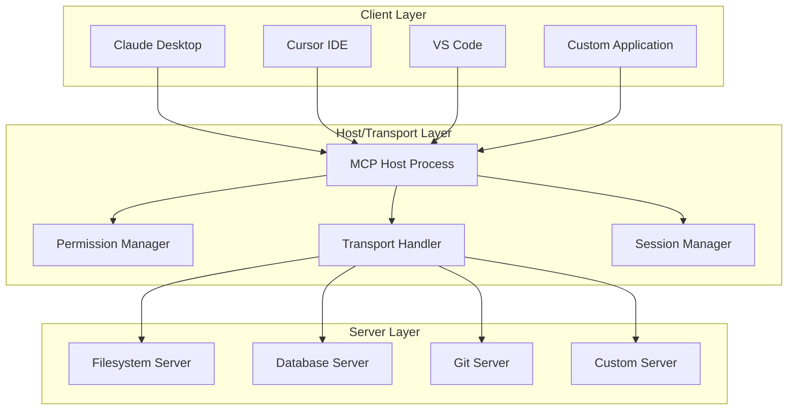
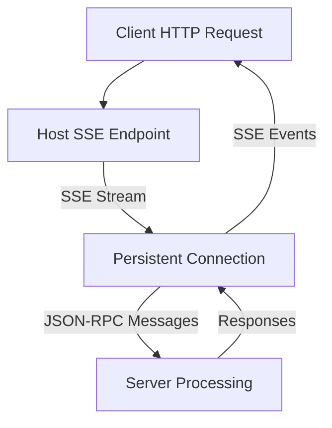

# Chapter 2: MCP Architecture and Protocol Specification

## Overview

This chapter provides a comprehensive technical examination of the Model Context Protocol architecture, message flows, and specification details. Understanding the underlying architecture is essential for building robust, secure, and performant MCP servers and clients. We'll explore the client-host-server topology, JSON-RPC message format, transport layer implementations, and security mechanisms that make MCP a production-ready protocol.

---

## 1. Client-Host-Server Topology Deep Dive

### 1.1 Component Architecture

MCP implements a three-layer architecture that separates concerns for security, flexibility, and scalability:



#### Client Layer Responsibilities

- **User Interface**: Present AI capabilities to end users
- **Intent Translation**: Convert user requests to MCP protocol messages
- **Response Rendering**: Format server responses for user consumption
- **Session Management**: Maintain conversation context and state

#### Host Layer Responsibilities

- **Connection Lifecycle**: Initialize, maintain, and terminate server connections
- **Permission Enforcement**: Apply security policies and approval workflows
- **Transport Management**: Handle stdio, SSE, and HTTP transport protocols
- **Resource Coordination**: Manage multiple concurrent server connections

#### Server Layer Responsibilities

- **Capability Exposure**: Define and implement tools, resources, and prompts
- **Protocol Compliance**: Handle MCP message format and patterns
- **State Management**: Maintain server-side state and data connections
- **Security Enforcement**: Implement sandboxing and access controls

---

## 2. JSON-RPC Message Format and Protocol Flows

### 2.1 Message Structure

MCP is built on JSON-RPC 2.0 with specific extensions for AI model integration:

#### Base Request Message
```json
{
  "jsonrpc": "2.0",
  "id": "string | integer | null",
  "method": "method_name",
  "params": {
    // Method-specific parameters
  }
}
```

#### Base Response Message
```json
{
  "jsonrpc": "2.0",
  "id": "string | integer | null",
  "result": {
    // Success response data
  }
}
```

#### Error Response Message
```json
{
  "jsonrpc": "2.0",
  "id": "string | integer | null",
  "error": {
    "code": -32000,
    "message": "Human approval required",
    "data": {
      "tool": "write_file",
      "path": "/etc/hosts",
      "reason": "System file modification requires confirmation"
    }
  }
}
```

### 2.2 Core Protocol Methods

#### Server Initialization
```json
{
  "method": "initialize",
  "params": {
    "protocolVersion": "2025-06-18",
    "capabilities": {
      "tools": {},
      "resources": {},
      "prompts": {}
    },
    "clientInfo": {
      "name": "Claude Desktop",
      "version": "1.0.0"
    }
  }
}
```

#### Tool Listing
```json
{
  "method": "tools/list",
  "params": {}
}
```

#### Tool Execution
```json
{
  "method": "tools/call",
  "params": {
    "name": "write_file",
    "arguments": {
      "path": "~/projects/example.txt",
      "content": "Hello, MCP!"
    }
  }
}
```

#### Resource Access
```json
{
  "method": "resources/read",
  "params": {
    "uri": "file:///home/user/project/config.json"
  }
}
```

### 2.3 Message Flow Patterns

#### Standard Tool Execution Flow
```mermaid
sequenceDiagram
    participant C as Client
    participant H as Host
    participant S as Server
    
    C->>H tools/call request
    H->>H Apply permission checks
    H->>S Forward request
    S->>S Execute tool logic
    S->>H Return response
    H->>H Apply response filtering
    H->>C Return final response
```

#### Human-in-the-Loop Approval Flow
```mermaid
sequenceDiagram
    participant C as Client
    participant H as Host
    participant U as User
    participant S as Server
    
    C->>H tools/call request (high risk)
    H->>H Detect approval requirement
    C->>U Request approval
    U->>C Provide approval decision
    C->>H Continue with approval
    H->>S Execute approved request
    S->>H Return result
    H->>C Complete flow
```

---

## 3. Capability Negotiation and Session Management

### 3.1 Server Capabilities

#### Tool Capabilities
```json
{
  "tools": {
    "listChanged": true,
    "experimentalFeatures": {
      "streamingResponses": true,
      "batchOperations": true
    }
  }
}
```

#### Resource Capabilities
```json
{
  "resources": {
    "subscribe": true,
    "listChanged": true
  }
}
```

#### Prompt Capabilities
```json
{
  "prompts": {
    "listChanged": true,
    "arguments": true
  }
}
```

### 3.2 Session Lifecycle

#### Session Initialization
```json
{
  "initialize": {
    "protocolVersion": "2025-06-18",
    "capabilities": {
      "roots": {
        "listChanged": true
      },
      "sampling": {}
    },
    "clientInfo": {
      "name": "Claude Desktop",
      "version": "1.0.0"
    }
  }
}
```

#### Initialized Confirmation
```json
{
  "method": "notifications/initialized",
  "params": {}
}
```

### 3.3 Transport-Agnostic Capabilities

MCP ensures consistent capability sets across different transport mechanisms:

```json
{
  "capabilityGuarantee": {
    "stdio": ["tools", "resources", "prompts"],
    "sse": ["tools", "resources", "prompts", "subscriptions"],
    "http": ["tools", "resources", "prompts", "streaming"]
  }
}
```

---

## 4. Transport Layer Implementations and Trade-offs

### 4.1 Standard Input/Output (stdio) Transport

#### Architecture


#### Implementation Details
```python
# Simplified stdio transport implementation
import asyncio
import sys
import json

class StdioTransport:
    def __init__(self):
        self.reader = asyncio.StreamReader()
        self.writer = asyncio.StreamWriter()
    
    async def send_message(self, message: dict):
        """Send JSON-RPC message over stdout"""
        json_message = json.dumps(message) + '\n'
        sys.stdout.write(json_message)
        sys.stdout.flush()
    
    async def receive_message(self) -> dict:
        """Receive JSON-RPC message from stdin"""
        line = await sys.stdin.readline()
        return json.loads(line.strip())
```

#### Advantages and Limitations
| Aspect | Advantages | Limitations |
|--------|------------|-------------|
| **Security** | No network exposure, inherits process permissions | Limited to local execution |
| **Performance** | Low latency, direct process communication | Single connection per server |
| **Scalability** | Simple deployment, minimal dependencies | Not ideal for distributed systems |
| **Debugging** | Easy to capture and analyze message flow | Limited monitoring capabilities |

### 4.2 Server-Sent Events (SSE) Transport

#### Architecture


#### Implementation Pattern
```javascript
// SSE Client Implementation
class SSETransport {
  constructor(url) {
    this.url = url;
    this.eventSource = null;
    this.pendingRequests = new Map();
  }
  
  async connect() {
    this.eventSource = new EventSource(this.url);
    
    this.eventSource.onmessage = (event) => {
      const response = JSON.parse(event.data);
      const pending = this.pendingRequests.get(response.id);
      if (pending) {
        pending.resolve(response);
        this.pendingRequests.delete(response.id);
      }
    };
  }
  
  async sendRequest(method, params) {
    const id = this.generateId();
    const request = { jsonrpc: "2.0", id, method, params };
    
    const responsePromise = new Promise((resolve, reject) => {
      this.pendingRequests.set(id, { resolve, reject });
    });
    
    fetch(this.url, {
      method: 'POST',
      headers: { 'Content-Type': 'application/json' },
      body: JSON.stringify(request)
    });
    
    return responsePromise;
  }
}
```

#### Configuration Examples
```json
{
  "sse_transport": {
    "command": "npx",
    "args": ["-y", "@modelcontextprotocol/server-postgres"],
    "env": {
      "MCP_TRANSPORT": "sse",
      "SSE_PORT": "8080",
      "CORS_ORIGIN": "http://localhost:3000"
    }
  }
}
```

### 4.3 HTTP/Streaming Transport

#### Server-Sent Events with Bidirectional Communication
```javascript
// HTTP/Streaming Server Implementation
class HTTPStreamingTransport {
  constructor(options = {}) {
    this.port = options.port || 8080;
    this.connections = new Set();
  }
  
  async startServer() {
    const server = express();
    
    server.get('/events', (req, res) => {
      // SSE endpoint for server->client communication
      res.writeHead(200, {
        'Content-Type': 'text/event-stream',
        'Cache-Control': 'no-cache',
        'Connection': 'keep-alive'
      });
      
      this.connections.add(res);
      
      req.on('close', () => {
        this.connections.delete(res);
      });
    });
    
    server.post('/request', express.json(), (req, res) => {
      // Handle client->server requests
      this.handleRequest(req.body);
      res.json({ status: 'received' });
    });
    
    server.listen(this.port);
  }
}
```

---

## 5. Security Model: Permissions, Auditing, and Isolation

### 5.1 Permission System Architecture

#### Capability-Based Access Control
```json
{
  "permissionModel": {
    "principle": "Capability-based security",
    "implementation": {
      "explicit_grant": "Permissions must be explicitly granted",
      "scope_limited": "Operations limited to defined boundaries",
      "revocable": "Permissions can be revoked at any time",
      "auditable": "All permission decisions are logged"
    }
  }
}
```

#### Permission Categories
```json
{
  "permissions": {
    "tools": {
      "low_risk": ["read_file", "list_directory", "search_files"],
      "medium_risk": ["write_file", "edit_file", "git_commit"],
      "high_risk": ["shell_execute", "database_write", "delete_file"],
      "critical": ["system_modify", "network_access", "credential_access"]
    },
    "resources": {
      "read_only": ["file://", "http://", "https://"],
      "read_write": ["file://workspace/", "file://temp/"],
      "protected": ["system://", "credential://"]
    }
  }
}
```

### 5.2 Human-in-the-Loop Approval System

#### Approval Workflow Matrix
```json
{
  "approvalMatrix": {
    "filesystem": {
      "read_operations": "auto_approve",
      "write_safe_paths": "remember_preference",
      "write_system_paths": "always_confirm",
      "delete_operations": "require_explicit_approval"
    },
    "shell": {
      "read_only_commands": "auto_approve",
      "build_commands": "remember_preference",
      "install_commands": "always_confirm",
      "system_commands": "blocked"
    },
    "database": {
      "read_queries": "auto_approve",
      "write_queries": "always_confirm",
      "schema_changes": "require_explicit_approval",
      "admin_operations": "blocked"
    }
  }
}
```

#### Approval State Management
```python
# Approval state persistence
class ApprovalManager:
    def __init__(self, storage_path: str):
        self.storage_path = storage_path
        self.approved_operations = self.load_approvals()
    
    async def check_approval(self, operation: dict) -> ApprovalResult:
        cache_key = self.generate_cache_key(operation)
        cached_approval = self.approved_operations.get(cache_key)
        
        if cached_approval and not cached_approval.expired:
            return ApprovalResult(cached_approval.decision, cached_approval.timestamp)
        
        # Request human approval
        decision = await self.request_approval(operation)
        self.store_approval(cache_key, decision)
        
        return ApprovalResult(decision, datetime.now())
```

### 5.3 Auditing and Logging

#### Comprehensive Audit Trail
```json
{
  "auditEvent": {
    "timestamp": "2025-11-25T10:30:00Z",
    "sessionId": "sess_abc123",
    "userId": "user_456",
    "operation": {
      "method": "tools/call",
      "tool": "write_file",
      "parameters": {
        "path": "~/projects/test.txt"
      }
    },
    "security": {
      "permission": "medium_risk",
      "approvalRequired": true,
      "approvalGranted": true,
      "approvalTimestamp": "2025-11-25T10:30:15Z"
    },
    "outcome": {
      "success": true,
      "duration": "250ms",
      "resourceImpact": "file_written"
    }
  }
}
```

#### Log Analysis and Monitoring
```python
# Security monitoring implementation
class SecurityMonitor:
    def __init__(self, alert_thresholds: dict):
        self.alert_thresholds = alert_thresholds
        self.anomaly_detector = AnomalyDetector()
    
    async def analyze_audit_log(self, events: List[AuditEvent]) -> List[Alert]:
        anomalies = await self.anomaly_detector.detect(events)
        
        alerts = []
        for anomaly in anomalies:
            if anomaly.risk_score > self.alert_thresholds['critical']:
                alerts.append(Alert.critical(anomaly))
            elif anomaly.risk_score > self.alert_thresholds['warning']:
                alerts.append(Alert.warning(anomaly))
        
        return alerts
```

---

## 6. Advanced Protocol Features

### 6.1 Streaming and Chunked Responses

#### Large Response Handling
```json
{
  "streamingResponse": {
    "method": "responses/create",
    "params": {
      "id": "resp_123",
      "model": "claude-3-5-sonnet",
      "maxTokens": 8192,
      "stream": true
    }
  },
  "streamingChunk": {
    "method": "notifications/resource/updated",
    "params": {
      "uri": "response://resp_123",
      "chunk": "First part of a large response..."
    }
  }
}
```

### 6.2 Resource Subscriptions

#### Change Notification System
```json
{
  "subscription": {
    "method": "resources/subscribe",
    "params": {
      "uri": "file:///workspace/project.json"
    }
  },
  "notification": {
    "method": "notifications/resource/updated",
    "params": {
      "uri": "file:///workspace/project.json",
      "change": "content_modified"
    }
  }
}
```

### 6.3 Tool Composition and Pipelining

#### Multi-Tool Workflows
```json
{
  "toolPipeline": {
    "method": "tools/call",
    "params": {
      "name": "execute_workflow",
      "arguments": {
        "workflow": [
          {
            "tool": "git_status",
            "parameters": {}
          },
          {
            "tool": "read_file",
            "parameters": {
              "path": "package.json"
            },
            "condition": "git_status.has_changes"
          },
          {
            "tool": "npm_install",
            "parameters": {},
            "condition": "package.json.modified"
          }
        ]
      }
    }
  }
}
```

---

## 7. Error Handling and Recovery

### 7.1 Standardized Error Codes

```json
{
  "errorCodes": {
    "-32700": "Parse error - Invalid JSON",
    "-32600": "Invalid Request - JSON-RPC formatting issue",
    "-32601": "Method not found",
    "-32602": "Invalid params",
    "-32603": "Internal error",
    "-32000": "Server error - Generic server error",
    "-32001": "Permission denied - Human approval required",
    "-32002": "Resource not found",
    "-32003": "Rate limit exceeded",
    "-32004": "Connection timeout"
  }
}
```

### 7.2 Recovery Strategies

#### Connection Resilience
```python
# Robust connection handling
class ResilientConnection:
    async def execute_with_retry(self, request: dict, max_retries: int = 3):
        for attempt in range(max_retries):
            try:
                return await self.send_request(request)
            except ConnectionError as e:
                if attempt == max_retries - 1:
                    raise
                
                wait_time = 2 ** attempt  # Exponential backoff
                await asyncio.sleep(wait_time)
                await self.reconnect()
```

#### Graceful Degradation
```python
# Fallback capability negotiation
class CapabilityNegotiator:
    async def negotiate_capabilities(self, client_capabilities, server_capabilities):
        # Find intersection of capabilities
        supported_capabilities = self.find_intersection(
            client_capabilities, 
            server_capabilities
        )
        
        if len(supported_capabilities) < self.required_capabilities:
            # Enable fallback modes
            return self.enable_fallback_mode(supported_capabilities)
        
        return supported_capabilities
```

---

## 8. Performance Optimization

### 8.1 Message Compression and Optimization

#### Efficient Message Formats
```json
{
  "optimizationStrategies": {
    "compression": {
      "gzip": "Enable for all responses > 1KB",
      "brotli": "Use for static resources when available"
    },
    "responseFiltering": {
      "selectiveFields": "Return only requested fields",
      "pagination": "Limit response sizes for large datasets",
      "summaries": "Provide summarized views for large content"
    },
    "caching": {
      "responseCache": "Cache frequently accessed resources",
      "metadataCache": "Cache server metadata and capabilities",
      "permissionCache": "Cache approval decisions"
    }
  }
}
```

### 8.2 Concurrent Operations

#### Parallel Tool Execution
```python
# Concurrent operation management
class ConcurrentExecutor:
    async def execute_parallel(self, tools: List[ToolCall]):
        """Execute multiple tools simultaneously when possible"""
        
        # Group independent tools
        independent_groups = self.group_independent_tools(tools)
        
        results = []
        for group in independent_groups:
            # Execute tools in parallel within each group
            group_results = await asyncio.gather(*[
                self.execute_single(tool) for tool in group
            ])
            results.extend(group_results)
        
        return results
```

---

## 9. Protocol Extensions and Customization

### 9.1 Custom Tool Categories

#### Extending the Protocol
```json
{
  "customCapabilities": {
    "mcp-extension": {
      "namespace": "company.internal",
      "version": "1.0.0",
      "methods": {
        "custom/workflow_execute": {
          "description": "Execute company-specific workflow",
          "parameters": {
            "workflowId": "string",
            "context": "object"
          }
        }
      }
    }
  }
}
```

### 9.2 Cross-Protocol Compatibility

#### Adapter Pattern Implementation
```python
# Protocol adapter for legacy systems
class ProtocolAdapter:
    def __init__(self, legacy_client):
        self.legacy_client = legacy_client
    
    async def translate_to_mcp(self, legacy_request) -> MCPRequest:
        """Translate legacy protocol to MCP format"""
        return MCPRequest(
            method=self.translate_method(legacy_request.method),
            params=self.translate_params(legacy_request.params)
        )
    
    async def translate_from_mcp(self, mcp_response) -> LegacyResponse:
        """Translate MCP response to legacy format"""
        return LegacyResponse(
            data=mcp_response.result,
            status="success" if not mcp_response.error else "error"
        )
```

---

## 10. Best Practices and Implementation Guidelines

### 10.1 Server Development Guidelines

#### Security Implementation Checklist
- [ ] Implement capability-based permission checks
- [ ] Add input validation and sanitization
- [ ] Include comprehensive audit logging
- [ ] Support human-in-the-loop approval workflows
- [ ] Use sandboxing for resource-intensive operations
- [ ] Implement proper error handling without exposing sensitive data

#### Performance Guidelines
- [ ] Use streaming responses for large datasets
- [ ] Implement intelligent caching strategies
- [ ] Support concurrent operations where appropriate
- [ ] Optimize message sizes through selective field return
- [ ] Monitor and limit resource usage per client

### 10.2 Client Implementation Guidelines

#### Robust Error Handling
```python
# Comprehensive error handling
class MCPClient:
    async def handle_request(self, request: dict):
        try:
            response = await self.transport.send_request(request)
        except NetworkError as e:
            return await self.handle_network_error(request, e)
        except ProtocolError as e:
            return await self.handle_protocol_error(request, e)
        except PermissionError as e:
            return await self.handle_permission_error(request, e)
        else:
            return await self.process_response(response)
```

---

## 11. Testing and Validation

### 11.1 Protocol Compliance Testing

#### Automated Test Suite
```python
# MCP Protocol compliance tests
class MCPProtocolTests:
    async def test_json_rpc_format(self):
        """Ensure all messages follow JSON-RPC 2.0 specification"""
        # Test message format compliance
        pass
    
    async def test_capability_negotiation(self):
        """Verify proper capability negotiation"""
        # Test initialization and capability exchange
        pass
    
    async def test_security_model(self):
        """Validate security controls are properly implemented"""
        # Test permission enforcement and approval workflows
        pass
    
    async def test_error_handling(self):
        """Test error scenarios and recovery"""
        # Test various error conditions and handling
        pass
```

---

## 12. Conclusion

The Model Context Protocol architecture provides a robust, secure, and scalable foundation for AI-tool integration. Key architectural insights include:

### Design Strengths
1. **Clear Separation of Concerns**: Client-Host-Server topology enables flexible deployment patterns
2. **Transport Agnostic**: Protocol works equally well over stdio, SSE, and HTTP transports
3. **Security First**: Capability-based permissions with human-in-the-loop approval
4. **Performance Optimized**: Streaming, caching, and concurrent operation support

### Implementation Considerations
1. **Security is Paramount**: Proper permission implementation is non-negotiable
2. **Performance Matters**: Efficient message handling determines user experience
3. **Compatibility is Key**: Protocol extensions should maintain backward compatibility
4. **Monitoring is Essential**: Audit trails enable security analysis and debugging

The MCP architecture has proven itself in production environments from individual developers to enterprise deployments. Understanding these architectural principles is essential for building robust MCP servers and clients that can scale from personal projects to enterprise systems.

---

*Next: Chapter 3 provides practical guidance for getting started with MCP setup and configuration.*
