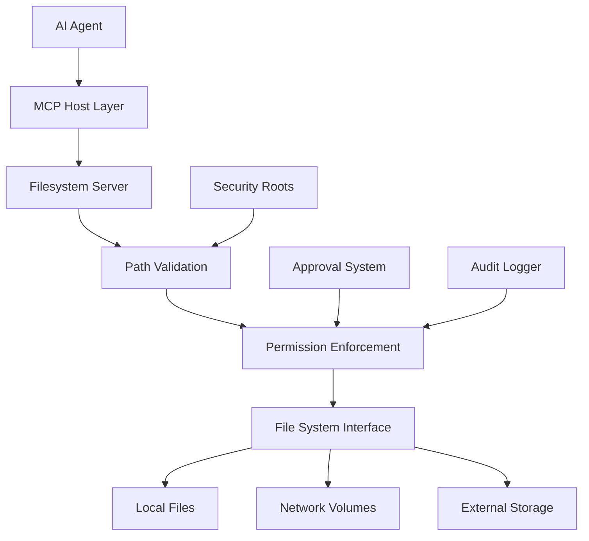

# Chapter 5: Filesystem Server - Local Development Foundation

## Overview

The `@modelcontextprotocol/server-filesystem` is arguably the most critical MCP server in the entire ecosystem. It serves as the bridge between the AI's abstract reasoning and the concrete reality of files and directories that make up software projects. This chapter provides comprehensive coverage of filesystem server architecture, security considerations, performance optimization, and real-world implementation patterns.

---

## 1. Architecture and Security Boundaries

### 1.1 Core Architecture

The filesystem MCP server implements a **capability-based security model** centered on controlled file system access:



### 1.2 Security Boundaries

#### Root Path-Based Sandboxing
The filesystem server implements strict path-based access controls:

```json
{
  "securityModel": {
    "principle": "Explicit permission granting",
    "implementation": "Root path allowlist",
    "enforcement": "Strict path boundary checking",
    "approval": "User confirmation for operations outside roots"
  }
}
```

#### Configuration Examples by Platform

**macOS / Linux**:
```json
{
  "filesystem": {
    "command": "npx",
    "args": [
      "-y", 
      "@modelcontextprotocol/server-filesystem",
      "/Users/developer/projects",
      "/Users/developer/documents",
      "/shared/team-repos"
    ]
  }
}
```

**Windows** (critical path escaping):
```json
{
  "filesystem": {
    "command": "npx",
    "args": [
      "-y",
      "@modelcontextprotocol/server-filesystem", 
      "C:\\Users\\developer\\Projects",
      "C:\\Users\\developer\\Documents",
      "D:\\shared\\Team-Code"
    ]
  }
}
```

---

## 2. File Operations: Complete Capability Matrix

### 2.1 Essential Capabilities

The filesystem server provides a comprehensive set of file operations:

| Tool | Function | Token Efficiency | Security Level | Use Case Priority |
|------|----------|------------------|----------------|-------------------|
| `read_file` | Full file content retrieval | Low (large files) | High | Initial context gathering |
| `edit_file` | Surgical patch-based editing | High (changes only) | Medium | Code refactoring |
| `write_file` | Complete file replacement | Medium | High | New file creation |
| `search_files` | Pattern-based content search | Variable | Medium | Code navigation |
| `list_directory` | Directory structure discovery | Low | Low | Project orientation |
| `directory_tree` | Recursive folder mapping | Low | Low | Architecture understanding |

### 2.2 Advanced Operations

#### Patch-Based Editing with `edit_file`
The `edit_file` tool represents a significant advancement over naive `write_file` operations:

```python
# Example edit_file operation
{
  "tool": "edit_file",
  "arguments": {
    "path": "~/projects/myapp/src/main.py",
    "old_text": "def process_data(data):\n    return data.upper()",
    "new_text": "def process_data(data):\n    \"\"\"Process data with validation\"\"\"\n    if not isinstance(data, str):\n        raise TypeError(\"Data must be string\")\n    return data.upper().strip()"
  }
}
```

**Benefits**:
- **Differential updates**: Only changed content is transmitted
- **Context awareness**: Maintains surrounding code structure
- **Atomic operations**: Reduces risk of partial writes
- **Rollback capability**: Easier to undo specific changes

#### Intelligent Search with `search_files`
Modern filesystem searches include advanced pattern matching:

```json
{
  "search_operations": {
    "regex_support": {
      "pattern": "def\\s+(\\w+)\\s*\\([^)]*\\):",
      "description": "Find all Python function definitions"
    },
    "file_type_filtering": {
      "include": ["*.py", "*.js", "*.java"],
      "exclude": ["*.test.*", "*.spec.*"]
    },
    "exclusion_patterns": {
      "directories": ["node_modules", ".git", "__pycache__"],
      "files": ["*.min.js", "*.bundle.js"]
    },
    "context_lines": {
      "before": 2,
      "after": 2,
      "max_results": 50
    }
  }
}
```

---

## 3. Cross-Platform Configuration Patterns

### 3.1 Platform-Specific Considerations

#### macOS Configuration
```json
{
  "macos_filesystem": {
    "command": "npx",
    "args": [
      "-y", "@modelcontextprotocol/server-filesystem",
      "~/Documents",
      "~/Desktop",
      "~/Developer",
      "/Applications",
      "~/Library/Mobile Documents/com~apple~CloudDocs"
    ],
    "env": {
      "HONOR_HIDDEN_FILES": "true",
      "APPLY_MACOS_PERMISSIONS": "true",
      "HANDLE_SYMLINKS": "follow"
    }
  }
}
```

#### Windows Configuration
```json
{
  "windows_filesystem": {
    "command": "npx",
    "args": [
      "-y",
      "@modelcontextprotocol/server-filesystem",
      "%USERPROFILE%\\Documents",
      "%USERPROFILE%\\Desktop",
      "%USERPROFILE%\\Source",
      "C:\\Projects",
      "%USERPROFILE%\\OneDrive"
    ],
    "env": {
      "HANDLE_WINDOWS_SHORTCUTS": "true",
      "RESPECT_NTFS_PERMISSIONS": "true",
      "CONVERT_PATH_SEPARATORS": "auto"
    }
  }
}
```

#### Linux Configuration
```json
{
  "linux_filesystem": {
    "command": "npx",
    "args": [
      "-y",
      "@modelcontextprotocol/server-filesystem",
      "~/Documents",
      "~/projects",
      "/var/www",
      "/opt/projects"
    ],
    "env": {
      "RESPECT_UNIX_PERMISSIONS": "true",
      "HANDLE_HARDLINKS": "follow",
      "APPLY_UMASK": "0022"
    }
  }
}
```

### 3.2 Development Environment Integration

#### VS Code Integration
```json
{
  "vscode_filesystem": {
    "command": "npx",
    "args": [
      "-y",
      "@modelcontextprotocol/server-filesystem",
      "~/.vscode",           # VS Code settings
      "~/projects",          # Workspaces
      "~/.vscode-server",    # Remote server configs
      "~/.vscode-insiders"   # Insiders edition
    ]
  }
}
```

#### Cursor IDE Integration
```json
{
  "cursor_filesystem": {
    "command": "npx",
    "args": [
      "-y",
      "@modelcontextprotocol/server-filesystem",
      "~/.cursor",           # Cursor settings
      "~/projects",          # Development projects
      "~/.cursorrules",      # Custom rules
      "~/.templates"         # Project templates
    ]
  }
}
```

---

## 4. Performance Optimization for Large Codebases

### 4.1 Token Management Intelligence

Large file operations can quickly consume context windows. The 2025 filesystem server includes intelligent optimization:

#### Selective Reading Strategies
```json
{
  "reading_strategy": {
    "small_files": {
      "threshold": "10KB",
      "method": "read_entirely",
      "reasoning": "Efficient for small files"
    },
    "medium_files": {
      "threshold": "10KB-100KB",
      "method": "read_with_metadata_first",
      "reasoning": "Allows selective content analysis"
    },
    "large_files": {
      "threshold": "> 100KB",
      "method": "read_specific_sections_or_use_search",
      "reasoning": "Prevents context window overflow"
    }
  }
}
```

#### Chunked Operations for Large Files
```javascript
// Advanced pattern for large files
{
  "large_file_processing": {
    "pattern": "Extract function X from large_file.js",
    "workflow": [
      {
        "step": "search_files('function X', 'large_file.js')",
        "purpose": "Locate function without reading entire file"
      },
      {
        "step": "read_file_with_line_range('large_file.js', start_line-5, end_line+5)",
        "purpose": "Read surrounding context"
      },
      {
        "step": "edit_file_targeting_specific_lines_only()",
        "purpose": "Precise editing without full file reload"
      },
      {
        "step": "verify_changes_with_git_diff()",
        "purpose": "Validate changes without full scan"
      }
    ]
  }
}
```

### 4.2 Caching and Indexing Strategies

#### Directory Caching
```python
# Intelligent directory cache implementation
class DirectoryCache:
    def __init__(self, max_size_mb=100):
        self.max_size = max_size_mb * 1024 * 1024
        self.cache = {}
        self.metadata = {}
    
    async def get_directory_listing(self, path: str) -> List[FileMetadata]:
        cached_result = self.cache.get(path)
        
        if cached_result and not self.is_expired(cached_result):
            return cached_result.files
        
        # Cache miss - scan directory
        files = await self.scan_directory(path)
        self.cache[path] = {
            'files': files,
            'timestamp': datetime.now(),
            'hash': self.calculate_directory_hash(path)
        }
        
        self.enforce_size_limit()
        return files
    
    def is_expired(self, cached_result: dict) -> bool:
        """Check if cached result is still valid"""
        age = datetime.now() - cached_result['timestamp']
        return age > timedelta(minutes=5)  # 5 minute cache TTL
```

#### File Content Caching
```json
{
  "content_caching_strategy": {
    "frequently_accessed": {
      "threshold": "accessed > 5 times in 24 hours",
      "cache_duration": "1 hour",
      "max_file_size": "1MB"
    },
    "project_metadata": {
      "package_json": "always cached",
      "ts_config_json": "always cached", 
      "gitignore": "always cached",
      "readme_md": "cache for 30 minutes"
    },
    "cache_eviction": {
      "strategy": "LRU with size limits",
      "max_total_size": "500MB",
      "max_file_count": "10000"
    }
  }
}
```

---

## 5. Permission Management and Security

### 5.1 Permission Tiers by Operation Type

| Operation Type | Default Permission | Risk Level | Recommended Setting |
|---------------|-------------------|-----------|-------------------|
| **Read operations** | Auto-approve | Low | Allow within roots |
| **Write existing files** | Prompt first | Medium | Ask for confirmation |
| **Create new files** | Prompt first | Medium | Ask for confirmation |
| **Delete operations** | Always prompt | High | Require explicit approval |
| **System file access** | Blocked | Critical | Never allow |

### 5.2 Advanced Permission Configuration

#### Fine-Grained Path Controls
```json
{
  "advanced_permissions": {
    "path_rules": {
      "~/projects/*": {
        "read": "auto_approve",
        "write": "prompt_first",
        "delete": "always_confirm"
      },
      "~/projects/production/*": {
        "read": "prompt_first",
        "write": "always_confirm", 
        "delete": "blocked"
      },
      "~/.ssh/*": {
        "read": "blocked",
        "write": "blocked",
        "delete": "blocked"
      },
      "/tmp/*": {
        "read": "auto_approve",
        "write": "auto_approve",
        "delete": "auto_approve"
      }
    },
    "file_type_rules": {
      "*.key": "blocked_read_write",
      "*.pem": "blocked_read_write", 
      "*.env": "prompt_read_write",
      "*.log": "auto_approve"
    }
  }
}
```

#### Conditional Approval Logic
```python
# Smart approval system
class FileOperationApproval:
    async def evaluate_operation(self, operation: FileOperation) -> ApprovalDecision:
        # Check path rules
        path_rule = self.get_path_rule(operation.path)
        if path_rule:
            return ApprovalDecision(path_rule.required_approval)
        
        # Check file type rules
        file_type_rule = self.get_file_type_rule(operation.path)
        if file_type_rule:
            return ApprovalDecision(file_type_rule.required_approval)
        
        # Check operation context
        if self.is_system_directory(operation.path):
            return ApprovalDecision.BLOCKED
        
        if self.large_operation(operation):
            return ApprovalDecision.REQUIRE_CONFIRMATION
        
        return ApprovalDecision.AUTO_APPROVE
```

---

## 6. Integration with Development Workflows

### 6.1 Multi-Server Coordination Patterns

#### Safe Refactoring Workflow
```json
{
  "safe_refactoring_workflow": {
    "preparation": {
      "1": "git_status", 
      "2": "git_diff --cached",
      "3": "memory_query('refactoring_guidelines')"
    },
    "execution": {
      "4": "search_files('old_function_signature')",
      "5": "read_files_with_matches",
      "6": "edit_file_multiple_locations",
      "7": "shell('npm run typecheck')",
      "8": "shell('pytest')"
    },
    "validation": {
      "9": "git_diff",
      "10": "shell('npm run build')", 
      "11": "git_commit",
      "12": "memory_store('successful_refactoring')"
    }
  }
}
```

#### Project Setup Automation
```json
{
  "project_setup_workflow": {
    "project_creation": [
      {
        "tool": "mkdir",
        "path": "~/projects/new-app"
      },
      {
        "tool": "write_file",
        "path": "~/projects/new-app/package.json",
        "content": "package.json template"
      },
      {
        "tool": "write_file", 
        "path": "~/projects/new-app/README.md",
        "content": "project readme template"
      }
    ],
    "git_initialization": [
      "git init ~/projects/new-app",
      "git add .",
      "git commit -m 'Initial project setup'"
    ],
    "dependency_installation": [
      "cd ~/projects/new-app",
      "npm install"
    ]
  }
}
```

### 6.2 IDE-Specific Integrations

#### VS Code Extension Integration
```json
{
  "vscode_integration": {
    "workspace_detection": {
      "method": "detect_vscode_workspace",
      "purpose": "Automatically identify VS Code workspace directories"
    },
    "extension_synergy": {
      "live_share": "Integrate with VS Code Live Share for collaboration",
      "gitLens": "Coordinate with GitLens for enhanced Git context",
      "remote_ssh": "Support for remote SSH workspace development"
    },
    "settings_sync": {
      "vscode_settings": "Synchronize settings.json with MCP context",
      "launch_configurations": "Include launch.json for development workflow",
      "tasks_configuration": "Process tasks.json for build automation"
    }
  }
}
```

---

## 7. Troubleshooting and Debugging

### 7.1 Common Filesystem Issues

| Symptom | Common Cause | Resolution Strategy |
|---------|--------------|-------------------|
| **File access denied** | Path not in allowlist | Add full path to args array |
| **Permission errors** | macOS Gatekeeper or Windows Defender | Add exceptions for MCP tools |
| **Symlink loops** | Circular symlinks causing infinite recursion | Configure symlink handling policy |
| **Large file timeouts** | Network storage latency | Increase timeout, use local caching |
| **Encoding issues** | Binary files detected as text | Configure content type detection |

### 7.2 Debugging Configuration

#### Verbose Logging Setup
```json
{
  "debug_configuration": {
    "filesystem": {
      "command": "npx",
      "args": ["-y", "@modelcontextprotocol/server-filesystem", "~/projects"],
      "env": {
        "DEBUG": "true",
        "LOG_LEVEL": "verbose",
        "AUDIT_OPERATIONS": "true",
        "CACHE_DEBUG": "true"
      }
    }
  }
}
```

#### Diagnostic Commands
```python
# Filesystem diagnostic tooling
class FilesystemDiagnostics:
    async def run_diagnostics(self) -> DiagnosticReport:
        report = DiagnosticReport()
        
        # Test path permissions
        report.add_section("path_permissions", await self.test_path_permissions())
        
        # Check symlink handling
        report.add_section("symlink_handling", await self.test_symlinks())
        
        # Validate encoding detection
        report.add_section("encoding_detection", await self.test_encoding())
        
        # Test large file handling
        report.add_section("large_file_handling", await self.test_large_files())
        
        return report
```

---

## 8. Advanced Usage Patterns

### 8.1 Template-Based Development

#### Project Template System
```json
{
  "template_system": {
    "react_project": {
      "template_files": [
        "package.json",
        "src/App.jsx", 
        "src/index.css",
        "public/index.html",
        "README.md"
      ],
      "setup_commands": [
        "npm install",
        "npm run build"
      ],
      "test_commands": [
        "npm test",
        "npm run lint"
      ]
    },
    "python_project": {
      "template_files": [
        "requirements.txt",
        "main.py",
        "setup.py",
        "README.md"
      ],
      "setup_commands": [
        "python -m venv venv",
        "source venv/bin/activate",
        "pip install -r requirements.txt"
      ],
      "test_commands": [
        "pytest",
        "python -m flake8"
      ]
    }
  }
}
```

### 8.2 Intelligent File Recognition

#### Content Type Detection
```python
# Advanced content type detection
class ContentTypeDetector:
    def __init__(self):
        self.detectors = {
            'code': self.detect_code files,
            'config': self.detect_config_files,
            'documentation': self.detect_documentation,
            'data': self.detect_data_files,
            'binary': self.detect_binary_files
        }
    
    async def analyze_file(self, path: str) -> FileAnalysis:
        content_sample = await self.read_file_sample(path, 1024)
        
        for file_type, detector in self.detectors.items():
            confidence = await detector(content_sample, path)
            if confidence > 0.8:
                return FileAnalysis(
                    type=file_type,
                    confidence=confidence,
                    suggested_operations=self.get_operations_for_type(file_type)
                )
        
        return FileAnalysis(type='unknown', confidence=0.0)
```

---

## 9. Enterprise Considerations

### 9.1 Corporate Environment Deployment

#### Network Volume Integration
```json
{
  "enterprise_filesystem": {
    "network_volumes": {
      "\\corp-server\\projects": "Windows network share",
      "nfs://corp-nas01/volumes/projects": "Linux NFS mount",
      "smb://fileserver.company.com/teams": "macOS/SMB connection"
    },
    "security_policies": {
      "scan_all_downloads": "true",
      "enforce_dlp_rules": "true", 
      "audit_file_access": "true",
      "require_approval_for_external": "true"
    },
    "performance_tuning": {
      "network_timeout": "30s",
      "retry_count": "3",
      "cache_network_files": "true",
      "prefetch_large_files": "false"
    }
  }
}
```

### 9.2 Compliance and Auditing

#### Data Loss Prevention Integration
```python
# DLP integration for enterprise environments
class DLPFileValidator:
    def __init__(self, dlp_rules_path: str):
        self.rules = self.load_dlp_rules(dlp_rules_path)
    
    async def validate_file_access(self, operation: FileOperation) -> ValidationResult:
        # Check file classification
        classification = await self.classify_file(operation.path)
        
        # Apply DLP rules
        for rule in self.rules:
            if rule.matches(classification, operation):
                return ValidationResult(
                    allowed=False,
                    reason=rule.violation_description,
                    requires_approval=True
                )
        
        # Check for sensitive content
        if await self.contains_sensitive_data(operation.path):
            return ValidationResult(
                allowed=False,
                reason="File contains sensitive data requiring special approval",
                requires_approval=True
            )
        
        return ValidationResult(allowed=True)
```

---

## 10. Best Practices Summary

### Security Best Practices
1. **Principle of least privilege**: Grant minimal necessary file system permissions
2. **Path boundary enforcement**: Strict validation of all file paths
3. **Approval workflows**: Human confirmation for sensitive operations
4. **Audit logging**: Comprehensive logging of all file operations
5. **Regular permission reviews**: Periodic audit of access permissions

### Performance Best Practices
1. **Strategic caching**: Cache frequently accessed files and directories
2. **Selective reading**: Use partial file reading for large files
3. **Background operations**: Perform expensive operations asynchronously
4. **Resource monitoring**: Track memory and disk usage
5. **Network optimization**: Configure timeouts and retry logic for network storage

### Development Workflow Best Practices
1. **Integration testing**: Test filesystem operations with other MCP servers
2. **Template reuse**: Store and reuse project templates and patterns
3. **Error handling**: Implement robust error handling for edge cases
4. **Documentation**: Document filesystem access patterns and conventions
5. **Version control awareness**: Integrate with Git for change tracking

---

## 11. Conclusion

The filesystem MCP server provides the fundamental infrastructure that enables AI agents to participate actively in software development workflows. Key takeaways:

- **Security is paramount**: Proper path-based permissions and approval systems are essential
- **Performance matters**: Intelligent caching and selective operations enable efficient large-scale use
- **Integration capability**: Coordination with other MCP servers creates powerful development workflows
- **Platform awareness**: Understanding cross-platform differences ensures reliable deployments

The combination of secure boundary enforcement, intelligent optimization, and comprehensive tooling makes the filesystem server indispensable for any AI-assisted development environment. As MCP continues to evolve, filesystem capabilities will expand to include advanced features like intelligent code organization, automated project structure analysis, and enhanced collaborative development patterns.

---

*Next: Chapter 6 explores Git Repository Server for version control and AI memory management.*
