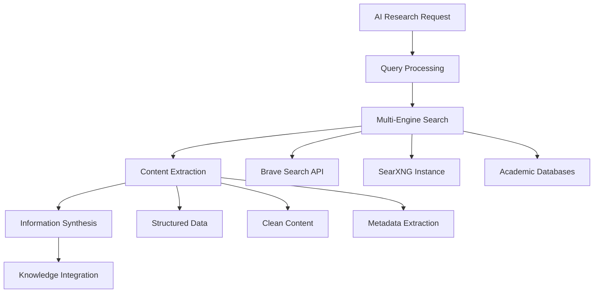

# Chapter 13: Search and Research Servers: Information Discovery and Knowledge Management

## Overview

Search and Research MCP servers provide AI agents with the ability to discover, retrieve, and analyze information from the web, academic databases, and personal knowledge bases. These servers transform LLMs from static knowledge repositories into active research assistants capable of conducting investigations, synthesizing findings, and maintaining up-to-date knowledge. This chapter explores web search engines, academic research tools, and personal knowledge management systems.

---

## 1. Web Search: From Queries to Actionable Intelligence

### 1.1 The Web Search Landscape in 2025

The integration of web search capabilities with AI agents has evolved dramatically since 2024. Modern MCP search servers provide:

- **Multi-engine capabilities**: Aggregating results across multiple search engines
- **Privacy-preserving approaches**: Avoiding search result profiling and tracking
- **Intelligent content extraction**: Moving beyond simple page text to structured data
- **Research workflow automation**: End-to-end investigation capabilities



### 1.2 Brave Search MCP: Privacy-First Web Intelligence

The `@modelcontextprotocol/server-brave-search` has emerged as the gold standard for privacy-preserving web search integration.

#### Architecture and Capabilities

**Core Search Operations**:
```json
{
  "search_capabilities": {
    "web_search": {
      "function": "general_web_queries",
      "privacy_features": "no_search_profiling",
      "result_format": "structured_summaries_with_metadata"
    },
    "local_search": {
      "function": "location_based_queries",
      "supported_queries": "businesses,_points_of_interest,_directions",
      "geographic_scope": "global_coverage"
    },
    "news_search": {
      "function": "recent_news_and_events",
      "freshness": "real_time",
      "source_diversity": "multiple_news_outlets"
    }
  }
}
```

#### Configuration and Setup

**Basic Configuration**:
```json
{
  "brave-search": {
    "command": "npx",
    "args": ["-y", "@modelcontextprotocol/server-brave-search"],
    "env": {
      "BRAVE_API_KEY": "YOUR_BRAVE_API_KEY_HERE",
      "MAX_RESULTS": "10",
      "CONTENT_FRESHNESS": "24h",
      "EXTRACT_METADATA": "true"
    }
  }
}
```

**Enhanced Research Configuration**:
```json
{
  "brave-search-enhanced": {
    "command": "npx",
    "args": ["-y", "@modelcontextprotocol/server-brave-search"],
    "env": {
      "BRAVE_API_KEY": "YOUR_BRAVE_API_KEY",
      "SEARCH_DEPTH": "comprehensive",
      "INCLUDE_NEWS": "true",
      "INCLUDE_ACADEMIC": "true",
      "CACHE_RESULTS": "true",
      "MAX_ARTICLE_LENGTH": "50000"
    }
  }
}
```

#### Advanced Search Workflows

**Deep Research Investigation**:
```json
{
  "deep_research_workflow": {
    "initial_search": {
      "tool": "brave-search",
      "action": "broad_topic_search",
      "query": "latest developments in quantum computing applications 2025",
      "parameters": {
        "result_count": 15,
        "content_types": ["academic", "news", "technical"],
        "date_range": "last_6_months"
      }
    },
    "follow_up_investigations": [
      {
        "area": "commercial_applications",
        "search_strategy": "find_company_announcements_and_products"
      },
      {
        "area": "research_breakthroughs", 
        "search_strategy": "locate_recent_papers_and_preprints"
      },
      {
        "area": "industry_analysis",
        "search_strategy": "identify_market_trends_and_projections"
      }
    ],
    "synthesis_phase": [
      "extract_key_findings_from_all_sources()",
      "identify_convergent_themes()",
      "analyze_conflicting_information()",
      "generate_comprehensive_summary()"
    ]
  }
}
```

### 1.3 SearXNG MCP: Self-Hosted Meta-Search

For organizations requiring data sovereignty and custom search sources, the SearXNG MCP server provides a powerful alternative to commercial search APIs.

#### Self-Hosted Search Infrastructure

**SearXNG Server Configuration**:
```json
{
  "searxng": {
    "command": "docker",
    "args": [
      "run", "--rm", "-p", "8080:8080",
      "-e", "SEARXNG_INSTANCE_NAME=research-search",
      "-v", "./searxng-config:/etc/searxng:ro",
      "searxng/searxng:latest"
    ]
  },
  "searxng-mcp": {
    "command": "npx",
    "args": ["-y", "mcp-server-searxng"],
    "env": {
      "SEARXNG_URL": "http://localhost:8080",
      "CUSTOM_ENGINES": "company_wiki,internal_documentation,technical_blogs"
    }
  }
}
```

**Enterprise Search Customization**:
```json
{
  "enterprise_search_sources": {
    "internal_documentation": {
      "engine_type": "elasticsearch",
      "endpoint": "https://docs.company.com",
      "authentication": "api_key_based"
    },
    "code_repositories": {
      "engine_type": "github_search",
      "scope": "organization_wide",
      "include_public_repos": "false"
    },
    "technical_blogs": {
      "engine_type": "rss_aggregation",
      "sources": ["industry_leaders", "technical_experts"],
      "freshness_requirement": "last_90_days"
    }
  }
}
```

---

## 2. Academic Research: Scholarly Investigation Automation

### 2.1 The Academic Research Challenge

AI agents need access to scholarly literature for:

- **Cutting-edge knowledge**: Beyond model training cutoff dates
- **Citation-enabled research**: Proper attribution and source tracking
- **Peer-reviewed validation**: Ensuring information quality
- **Cross-disciplinary insights**: Connecting research across fields

### 2.2 ArXiv MCP Server: Preprint Research Automation

The arXiv MCP server provides direct access to the world's largest repository of scientific preprints.

#### Capabilities and Configuration

**ArXiv Server Setup**:
```json
{
  "arxiv": {
    "command": "python",
    "args": ["-m", "arxiv_mcp.server"],
    "env": {
      "MAX_PAPERS_PER_SEARCH": "20",
      "INCLUDE_ABSTRACTS": "true",
      "INCLUDE_METADATA": "true",
      "CACHE_PERIOD": "24h"
    }
  }
}
```

**Research Operations**:
```json
{
  "arxiv_operations": {
    "search_papers": {
      "function": "advanced_paper_search",
      "parameters": {
        "query": "machine learning applications in drug discovery",
        "categories": ["cs.AI", "cs.LG", "q-bio.QM"],
        "date_range": "2024-01-01_to_2025-11-23",
        "sort_by": "relevance",
        "max_results": 15
      }
    },
    "paper_analysis": {
      "function": "comprehensive_paper_analysis",
      "extraction": {
        "abstract_and_introduction": "extract_core_contributions",
        "methodology": "analyze_approach_and_techniques",
        "results": "summarize_key_findings",
        "references": "extract_citation_network"
      }
    },
    "citation_tracking": {
      "function": "citation_network_analysis",
      "identifies": "highly_cited_works, research_influences, trends"
    }
  }
}
```

#### Advanced Research Workflows

**Literature Review Automation**:
```json
{
  "automated_literature_review": {
    "topic_definition": {
      "research_area": "quantum machine learning",
      "specific_focus": "variational quantum algorithms",
      "time_scope": "last_18_months"
    },
    "research_pipeline": [
      {
        "step": "initial_broad_search",
        "strategy": "find_recent_survey_and_review_papers",
        "expected_output": "foundational_understanding_and_references"
      },
      {
        "step": "focused_search",
        "strategy": "drill_down_into_specific_techniques",
        "expected_output": "detailed_technical_understanding"
      },
      {
        "step": "citation_network_analysis", 
        "strategy": "trace_influential_works_and_developments",
        "expected_output": "historical_context_and_progression"
      },
      {
        "step": "gap_identification",
        "strategy": "identify_research_opportunities_and_open_questions",
        "expected_output": "potential_contribution_areas"
      }
    ],
    "synthesis_outputs": [
      "comprehensive_literature_summary",
      "research_timeline",
      "method_survey",
      "future_directions_outline"
    ]
  }
}
```

### 2.3 Multi-Database Research Integration

#### Cross-Platform Academic Search

Comprehensive research requires integration across multiple academic databases:

**Multi-Database Configuration**:
```json
{
  "academic-research-suite": {
    "arxiv": {
      "command": "python",
      "args": ["-m", "arxiv_mcp.server"],
      "scope": "preprints_and_early_research"
    },
    "semantic-scholar": {
      "command": "npx", 
      "args": ["-y", "semantic-scholar-mcp"],
      "scope": "citation_networks_and_related_works"
    },
    "pubmed": {
      "command": "python",
      "args": ["-m", "pubmed_mcp.server"],
      "scope": "biomedical_and_life_sciences"
    },
    "crossref": {
      "command": "npx",
      "args": ["-y", "crossref-mcp"],
      "scope": "published_citations_and_metadata"
    }
  }
}
```

**Unified Research Workflow**:
```json
{
  "comprehensive_research_workflow": {
    "phase_1_exploration": [
      "search_across_all_databases(initial_query)",
      "identify_key_papers_and_authors()", 
      "map_research_landscape()"
    ],
    "phase_2_deep_dive": [
      "download_full_papers(top_10_results)",
      "extract_and_summarize_methodology()",
      "analyze_results_and_conclusions()"
    ],
    "phase_3_synthesis": [
      "identify_research_trends()",
      "locate_research_gaps()",
      "synthesize_findings_across_disciplines()"
    ]
  }
}
```

---

## 3. Knowledge Management and Personal Research

### 3.1 Local Knowledge Bases: RAG Implementation

Retrieval-Augmented Generation (RAG) transforms local documents into searchable knowledge bases.

#### Vector Database Integration

**Knowledge Management Stack**:
```json
{
  "knowledge_management": {
    "document_processor": {
      "command": "python",
      "args": ["-m", "document_mcp.processor"],
      "capabilities": ["pdf_processing", "markdown_parsing", "web_scraping"]
    },
    "vector_database": {
      "command": "docker",
      "args": [
        "run", "--rm", "-p", "6333:6333",
        "qdrant/qdrant:latest"
      ]
    },
    "retrieval_system": {
      "command": "npx",
      "args": ["-y", "rag-retrieval-mcp"],
      "env": {
        "VECTOR_DB_URL": "http://localhost:6333",
        "EMBEDDING_MODEL": "text-embedding-3-large",
        "TOP_K_RETRIEVAL": "5"
      }
    }
  }
}
```

#### Document Indexing and Search

**Document Ingestion Pipeline**:
```json
{
  "document_ingestion_pipeline": {
    "input_sources": [
      "local_file_system({pdf,txt,md,docx})",
      "web_pages({documentation,blogs})",
      "api_documentation({openapi_specs})", 
      "code_repositories({readme_files,code_comments})"
    ],
    "processing_stages": [
      {
        "stage": "content_extraction",
        "methods": ["ocr_for_scans", "markdown_parsing", "code_extraction"]
      },
      {
        "stage": "chunking_strategy", 
        "methods": ["semantic_chunking", "recursive_character_splitting"]
      },
      {
        "stage": "embedding_generation",
        "models": ["text-embedding-3-large", "local_sentence_transformers"]
      },
      {
        "stage": "vector_storage",
        "databases": ["qdrant", "chroma", "pinecone"]
      }
    ],
    "indexing_capabilities": [
      "semantic_search_across_all_documents",
      "cross_reference_document_relationships", 
      "track_document_versions_and_changes",
      "extract_and_index_code_snippets"
    ]
  }
}
```

### 3.2 Personal Knowledge Systems

#### Obsidian Integration

**Obsidian MCP Server**: Provides access to personal note-taking vaults with network visualization and content analysis.

**Configuration**:
```json
{
  "obsidian": {
    "command": "npx",
    "args": ["-y", "obsidian-mcp"],
    "env": {
      "OBSIDIAN_VAULT_PATH": "~/Documents/ObsidianVault",
      "ENABLE_GRAPH_ANALYSIS": "true",
      "INCLUDE_ATTACHMENTS": "false",
      "SEARCH_DEPTH": "comprehensive"
    }
  }
}
```

**Personal Knowledge Workflow**:
```json
{
  "personal_knowledge_workflow": {
    "knowledge_discovery": [
      "search_personal_notes_for_relevant_context()",
      "identify_connected_concepts()",
      "extract_project_specific_information()"
    ],
    "knowledge_enhancement": [
      "integrate_new_research_findings()",
      "update_connections_between_concepts()",
      "generate_summary_notes()"
    ],
    "knowledge_application": [
      "apply_learned_patterns()",
      "suggest_related_topics()",
      "identify_knowledge_gaps()"
    ]
  }
}
```

---

## 4. Research Automation and Workflows

### 4.1 Intelligent Research Agents

Multi-step research automation requires coordination between multiple MCP servers.

#### Research Orchestration

**Comprehensive Research Agent Configuration**:
```json
{
  "research_agent": {
    "search_layer": {
      "brave-search": "web_and_news_discovery",
      "searxng": "enterprise_and_internal_search"
    },
    "academic_layer": {
      "arxiv": "preprint_research", 
      "semantic-scholar": "citation_analysis"
    },
    "knowledge_layer": {
      "rag-system": "context_retrieval",
      "obsidian": "personal_knowledge"
    },
    "processing_layer": {
      "docling": "document_conversion",
      "sequential-thinking": "research_strategy"
    }
  }
}
```

#### Automated Research Workflows

**Market Research Automation**:
```json
{
  "market_research_automation": {
    "research_objective": "Analyze competitive landscape for AI development tools",
    "workflow_stages": [
      {
        "stage": "industry_overview",
        "tools": ["brave-search", "docling"],
        "objectives": ["identify_major_players", "understand_market_size", "track_growth_trends"]
      },
      {
        "stage": "competitor_analysis",
        "tools": ["brave-search", "factual_parsing"],
        "objectives": ["analyze_competitor_products", "identify_strengths_weaknesses", "track_recent_developments"]
      },
      {
        "stage": "technical_research",
        "tools": ["arxiv", "semantic-scholar"],
        "objectives": ["review_relevant_academic_work", "identify_emerging_technologies", "assess_technical_feasibility"]
      },
      {
        "stage": "synthesis_and_report",
        "tools": ["sequential-thinking", "docling"],
        "objectives": ["synthesize_findings", "generate_competitive_analysis", "identify_opportunities_threats"]
      }
    ]
  }
}
```

### 4.2 Research Quality Assurance

#### Fact-Checking and Verification

**Quality Assurance Workflow**:
```json
{
  "research_quality_assurance": {
    "source_validation": [
      "verify_source_credibility()",
      "check_publication_dates()",
      "cross_reference_multiple_sources()",
      "identify_potential_biases()"
    ],
    "content_verification": [
      "fact_check_claims_using_multiple_sources()",
      "verify_statistics_and_data_points()",
      "check_methodology_validity()",
      "assess_argument_logic()"
    ],
    "citation_management": [
      "generate_proper_citations()",
      "format_bibliography_consistently()", 
      "track_source_versions()",
      "maintain_attribution_chain()"
    ]
  }
}
```

---

## 5. Advanced Search Techniques

### 5.1 Semantic and Contextual Search

Moving beyond keyword matching to understand intent and context.

#### Intent Recognition

**Advanced Search Configuration**:
```json
{
  "advanced_search": {
    "semantic_search": {
      "command": "npx",
      "args": ["-y", "semantic-search-mcp"],
      "env": {
        "EMBEDDING_MODEL": "text-embedding-3-large",
        "SIMILARITY_THRESHOLD": "0.85",
        "CONTEXT_WINDOW": "8000"
      }
    },
    "contextual_query": {
      "approach": "understand_search_intent_and_context",
      "capabilities": ["intent_classification", "context_completion", "query_expansion"]
    }
  }
}
```

**Intent-Based Search Examples**:
```json
{
  "search_intent_examples": {
    "fact_finding": {
      "query": "What are the performance characteristics of Rust?",
      "intent": "obtain_specific_factual_information",
      "search_strategy": "targeted_precision_search"
    },
    "comparative_analysis": {
      "query": "Rust vs Go for web development in 2025",
      "intent": "compare_and_contrast_options",
      "search_strategy": "multi_perspective_analysis"
    },
    "exploratory_research": {
      "query": "emerging trends in quantum computing applications",
      "intent": "discover_new_information",
      "search_strategy": "broad_exploration_with_depth_drills"
    },
    "problem_solving": {
      "query": "strategies for optimizing database performance with large datasets",
      "intent": "find_solutions_to_specific_problems",
      "search_strategy": "solution_focused_search"
    }
  }
}
```

### 5.2 Real-Time Information Monitoring

#### Alerting and Watch Systems

**Monitoring Configuration**:
```json
{
  "information_monitoring": {
    "news_monitor": {
      "command": "npx",
      "args": ["-y", "news-monitor-mcp"],
      "capabilities": ["keyword_tracking", "topic_monitoring", "company_news"]
    },
    "academic_monitor": {
      "command": "python",
      "args": ["-m", "academic_monitor.server"],
      "capabilities": ["new_paper_alerts", "citation_notifications", "author_tracking"]
    },
    "market_monitor": {
      "command": "npx", 
      "args": ["-y", "market-intel-mcp"],
      "capabilities": ["competitor_tracking", "market_trends", "product_updates"]
    }
  }
}
```

---

## 6. Integration Patterns and Composite Workflows

### 6.1 Cross-Reference Intelligence

Combining multiple information sources to create comprehensive understanding.

**Cross-Reference Workflow**:
```json
{
  "cross_reference_intelligence": {
    "information_gathering": [
      "web_search_current_news()",
      "academic_paper_analysis()",
      "expert_opinion_search()",
      "data_source_validation()"
    ],
    "information_synthesis": [
      "identify_overlapping_findings()",
      "resolve_conflicting_information()",
      "establish_confidence_levels()",
      "create_comprehensive_picture()"
    ],
    "actionable_insights": [
      "extract_key_takeaways()",
      "identify_opportunities_threats()",
      "recommend_next_steps()",
      "create_monitoring_plan()"
    ]
  }
}
```

### 6.2 Research Project Management

#### Long-Term Research Coordination

**Research Management System**:
```json
{
  "research_project_management": {
    "project_setup": [
      "define_research_objectives()",
      "identify_information_sources()",
      "establish_monitoring_keywords()",
      "create_timeline_and_milestones()"
    ],
    "ongoing_research": [
      "scheduled_information_gathering()",
      "automated_fact_checking()",
      "knowledge_base_updates()",
      "progress_tracking()"
    ],
    "deliverable_generation": [
      "synthesize_findings()",
      "create_visual_summaries()",
      "generate_citations()",
      "produce_final_report()"
    ]
  }
}
```

---

## 7. Configuration Management

### 7.1 Environment-Specific Setups

#### Research Environment

**Comprehensive Research Stack**:
```json
{
  "research_stack": {
    "brave-search": {
      "command": "npx",
      "args": ["-y", "@modelcontextprotocol/server-brave-search"],
      "env": {
        "BRAVE_API_KEY": "YOUR_KEY",
        "SEARCH_DEPTH": "research"
      }
    },
    "arxiv": {
      "command": "python",
      "args": ["-m", "arxiv_mcp.server"]
    },
    "rag-system": {
      "command": "npx",
      "args": ["-y", "rag-mcp"],
      "env": {
        "VECTOR_DB_URL": "http://localhost:6333"
      }
    },
    "docling": {
      "command": "python",
      "args": ["-m", "docling_mcp.server"]
    },
    "obsidian": {
      "command": "npx",
      "args": ["-y", "obsidian-mcp", "~/Notes"]
    }
  }
}
```

#### Lightweight Research Setup

**Essential Research Tools**:
```json
{
  "lightweight_research": {
    "brave-search": {
      "command": "npx",
      "args": ["-y", "@modelcontextprotocol/server-brave-search"],
      "env": {
        "BRAVE_API_KEY": "YOUR_KEY",
        "MAX_RESULTS": "5"
      }
    },
    "fetch": {
      "command": "npx",
      "args": ["-y", "@modelcontextprotocol/server-fetch"]
    },
    "memory": {
      "command": "npx",
      "args": ["-y", "@modelcontextprotocol/server-memory"]
    }
  }
}
```

---

## 8. Performance Optimization

### 8.1 Search Optimization Strategies

#### Efficiency and Cost Management

**Search Performance Optimization**:
```json
{
  "performance_optimizations": {
    "caching_strategies": {
      "search_results": "cache_frequent_queries_for_24h",
      "document_content": "store_processed_locally",
      "embedding_reuse": "maintain_embedding_cache"
    },
    "query_optimization": {
      "search_precision": "refine_queries_for_better_results",
      "parallel_search": "run_multiple_engines_simultaneously",
      "result_filtering": "pre_filter_for_relevance"
    },
    "resource_management": {
      "token_optimization": "compress_search_results",
      "bandwidth_efficiency": "prioritize_essential_content",
      "computation_distribution": "balance_local_vs_cloud_processing"
    }
  }
}
```

---

## 9. Security and Privacy Considerations

### 9.1 Data Protection in Research

#### Confidential Research Practices

**Security Configuration**:
```json
{
  "research_security": {
    "api_key_management": {
      "storage_method": "environment_variables_only",
      "rotation_schedule": "quarterly",
      "access_logging": "detailed_usage_tracking"
    },
    "data_handling": {
      "local_processing": "process_sensitive_locally_when_possible",
      "content_filtering": "remove_personal_identifiers", 
      "search_anonymization": "use_privacy_preserving_search"
    },
    "access_control": {
      "source_whitelisting": "limit_to_approved_sources",
      "content_validation": "verify_source_authenticity",
      "audit_trail": "maintain_complete_research_log"
    }
  }
}
```

---

## 10. Troubleshooting and Debugging

### 10.1 Common Research Issues

| Problem | Common Cause | Resolution Strategy |
|---------|--------------|-------------------|
| **Limited search results** | API rate limits or insufficient queries | Broaden search terms, use multiple engines |
| **Poor content quality** | Source reliability issues | Add source validation, use academic databases |
| **Slow processing** | Large documents or network latency | Implement chunking, use local processing |
| **Citation errors** | Format inconsistencies | Standardize citation formatting, use citation management tools |

---

## 11. Future Trends and Developments

### 11.1 Emerging Research Capabilities

**Real-Time Academic Publishing**: Integration with preprint servers for immediate access to new research.

**Multi-modal Search**: Search across text, images, video, and audio content within research materials.

**Predictive Intelligence**: AI systems that anticipate research needs based on project context and user behavior.

### 11.2 Industry Evolution

**Enterprise Research Platforms**: Integrated research ecosystems combining internal knowledge bases with external intelligence.

**Collaborative Research Networks**: Shared research resources and real-time collaboration capabilities across organizational boundaries.

**AI-Assisted Discovery**: Systems that actively identify research opportunities and suggest novel investigation directions.

---

## 12. Best Practices Summary

### Search Best Practices
1. **Multi-source validation**: Cross-reference information across multiple sources
2. **Source credibility assessment**: Always evaluate source reliability and bias
3. **Query refinement**: Iteratively improve search queries based on results
4. **Result caching**: Cache frequently accessed information to reduce costs

### Research Best Practices
1. **Systematic approach**: Use structured research methodologies rather than ad-hoc searching
2. **Comprehensive documentation**: Track all sources, dates, and access methods
3. **Quality assurance**: Implement fact-checking and verification processes
4. **Ethical consideration**: Respect copyright and licensing requirements

### Integration Best Practices
1. **Knowledge base maintenance**: Regularly update and prune information stores
2. **Workflow automation**: Standardize repeatable research processes
3. **Collaboration enablement**: Design systems that support team-based research
4. **Performance monitoring**: Track search effectiveness and optimize strategies

---

## 13. Conclusion

Search and Research MCP servers have fundamentally transformed how AI agents access and process information. By combining privacy-preserving web search, academic database integration, and sophisticated knowledge management systems, these servers enable:

- **Up-to-date knowledge** access beyond static training data
- **Research automation** that accelerates discovery and analysis  
- **Personal knowledge integration** that combines external information with internal expertise
- **Quality assurance** through source validation and fact-checking
- **Ethical research practices** that respect privacy and intellectual property

The evolution from simple web search to comprehensive research intelligence represents one of the most significant advances in AI capability. As these tools continue to mature, they will become indispensable for knowledge workers, researchers, and organizations seeking to maintain competitive advantage through rapid access to accurate, relevant information.

---

*Next: Chapter 14 explores API Integration and OpenAPI Servers for dynamic tool generation.*
