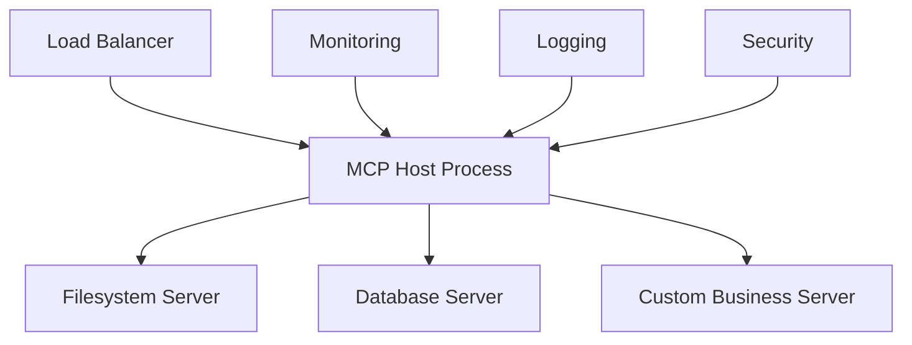
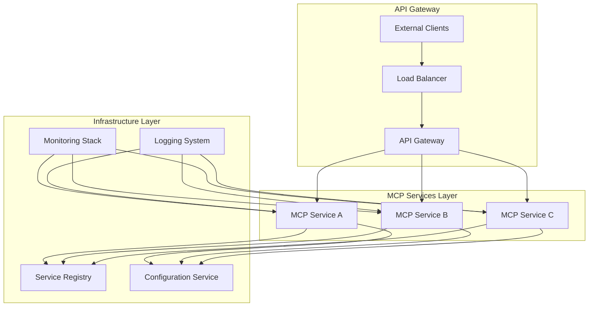

# Chapter 25: Production Operations and Management

## Overview

This final chapter provides comprehensive guidance for deploying, managing, and maintaining MCP server infrastructure in production environments. From scaling individual servers to managing enterprise deployments, this chapter covers monitoring, security, backup strategies, and future roadmap planning. Understanding these operational considerations is essential for successfully running MCP systems at scale.

---

## 1. Deployment Patterns and Infrastructure Management

### 1.1 Production Deployment Architectures

#### Single Server Deployment


**Use Cases:**
- Small development teams
- Single-application deployments
- Proof of concept implementations

**Configuration:**
```json
{
  "production_single": {
    "host": {
      "command": "node",
      "args": ["dist/host.js"],
      "env": {
        "NODE_ENV": "production",
        "MCP_HOST_PORT": "8080",
        "LOG_LEVEL": "info"
      }
    },
    "servers": {
      "filesystem": {
        "command": "docker",
        "args": ["run", "--rm", "mcp-filesystem:prod"],
        "resources": {
          "memory": "256MB",
          "cpu": "0.5"
        }
      },
      "database": {
        "command": "uvx",
        "args": ["mcp-server-postgres", "--connection-pool-size", "10"],
        "resources": {
          "memory": "512MB",
          "cpu": "1.0"
        }
      }
    }
  }
}
```

#### Microservices Deployment


**Kubernetes Deployment**:
```yaml
# mcp-host-deployment.yaml
apiVersion: apps/v1
kind: Deployment
metadata:
  name: mcp-host
  labels:
    app: mcp-host
spec:
  replicas: 3
  selector:
    matchLabels:
      app: mcp-host
  template:
    metadata:
      labels:
        app: mcp-host
    spec:
      containers:
      - name: mcp-host
        image: my-registry/mcp-host:latest
        ports:
        - containerPort: 8080
        env:
        - name: CONFIG_SERVICE_URL
          value: "http://config-service:8080"
        - name: SERVICE_REGISTRY_URL
          value: "http://registry:8080"
        resources:
          requests:
            memory: "256Mi"
            cpu: "250m"
          limits:
            memory: "512Mi"
            cpu: "500m"
        livenessProbe:
          httpGet:
            path: /health
            port: 8080
          initialDelaySeconds: 30
          periodSeconds: 10
        readinessProbe:
          httpGet:
            path: /ready
            port: 8080
          initialDelaySeconds: 5
          periodSeconds: 5

---
apiVersion: v1
kind: Service
metadata:
  name: mcp-host-service
spec:
  selector:
    app: mcp-host
  ports:
  - protocol: TCP
    port: 80
    targetPort: 8080
  type: LoadBalancer
```

#### Hybrid Cloud Deployment
```json
{
  "hybrid_deployment": {
    "local_servers": {
      "filesystem": {
        "type": "stdio",
        "command": "npx",
        "args": ["-y", "@modelcontextprotocol/server-filesystem", "~/workspace"],
        "location": "on_premise"
      },
      "git": {
        "type": "stdio", 
        "command": "uvx",
        "args": ["mcp-server-git"],
        "location": "on_premise"
      }
    },
    "cloud_servers": {
      "database": {
        "type": "sse",
        "url": "https://mcp-db.company.com",
        "location": "cloud",
        "backup": "multi_region"
      },
      "search": {
        "type": "http",
        "url": "https://mcp-search.company.com",
        "location": "cloud",
        "cdn": "enabled"
      }
    },
    "security": {
      "local_acls": "strict_local_access",
      "cloud_auth": "oauth2_sso",
      "data_encryption": "end_to_end"
    }
  }
}
```

---

## 2. Monitoring, Logging, and Observability

### 2.1 Comprehensive Monitoring Stack

#### Metrics Collection
```python
# monitoring.py
import time
from prometheus_client import Counter, Histogram, Gauge, start_http_server
from mcp.server.fastmcp import FastMCP

# Define metrics
REQUEST_COUNT = Counter('mcp_requests_total', 'Total MCP requests', ['server', 'method'])
REQUEST_DURATION = Histogram('mcp_request_duration_seconds', 'MCP request duration')
ACTIVE_CONNECTIONS = Gauge('mcp_active_connections', 'Number of active connections')
SERVER_MEMORY_USAGE = Gauge('mcp_server_memory_bytes', 'Server memory usage')

class MCPMonitor:
    def __init__(self, port: int = 9090):
        self.port = port
        self.start_metrics_server()
    
    def start_metrics_server(self):
        """Start Prometheus metrics server."""
        start_http_server(self.port)
    
    def record_request(self, server: str, method: str, duration: float):
        """Record request metrics."""
        REQUEST_COUNT.labels(server=server, method=method).inc()
        REQUEST_DURATION.observe(duration)
    
    def update_connection_count(self, count: int):
        """Update active connection count."""
        ACTIVE_CONNECTIONS.set(count)

# Integration with FastMCP
monitor = MCPMonitor()

mcp = FastMCP("monitored-server")

@mcp.middleware
async def monitor_middleware(request, next_handler):
    """Middleware to monitor all requests."""
    start_time = time.time()
    
    try:
        response = await next_handler(request)
        duration = time.time() - start_time
        monitor.record_request("monitored-server", request.method, duration)
        return response
    except Exception as e:
        duration = time.time() - start_time
        monitor.record_request("monitored-server", request.method, duration)
        raise

@mcp.tool()
def monitored_operation(data: str) -> str:
    """Tool with custom metrics."""
    # Record custom business metrics
    monitor = MCPMonitor()
    SERVER_MEMORY_USAGE.set(get_memory_usage())
    
    return process_data(data)
```

#### Distributed Tracing
```python
# tracing.py
from opentelemetry import trace
from opentelemetry.exporter.jaeger.thrift import JaegerExporter
from opentelemetry.sdk.trace import TracerProvider
from opentelemetry.sdk.trace.export import BatchSpanProcessor
from opentelemetry.instrumentation.fastapi import FastAPIInstrumentor

# Configure tracing
def setup_tracing(service_name: str):
    # Set up trace provider
    trace.set_tracer_provider(TracerProvider())
    tracer = trace.get_tracer(__name__)
    
    # Configure Jaeger exporter
    jaeger_exporter = JaegerExporter(
        agent_host_name="jaeger",
        agent_port=6831,
    )
    
    # Add span processor
    span_processor = BatchSpanProcessor(jaeger_exporter)
    trace.get_tracer_provider().add_span_processor(span_processor)
    
    return tracer

# Usage in MCP server
tracer = setup_tracing("mcp-server")

@mcp.tool()
async def traced_operation(input_data: str) -> str:
    """Operation with distributed tracing."""
    with tracer.start_as_current_span("traced_operation") as span:
        span.set_attribute("input_length", len(input_data))
        
        try:
            result = await process_data(input_data)
            span.set_attribute("result_length", len(result))
            return result
        except Exception as e:
            span.record_exception(e)
            span.set_status(trace.Status(trace.StatusCode.ERROR, str(e)))
            raise
```

#### Health Checks and Endpoints
```python
# health.py
from pydantic import BaseModel
from typing import Dict, List
import asyncio
import psutil

class HealthStatus(BaseModel):
    status: str
    server: str
    version: str
    uptime: float
    memory_usage: float
    active_connections: int
    dependencies: Dict[str, bool]

class HealthChecker:
    def __init__(self):
        self.start_time = time.time()
        self.dependencies = {}
    
    async def check_health(self) -> HealthStatus:
        """Comprehensive health check."""
        return HealthStatus(
            status="healthy" if await self.all_healthy() else "degraded",
            server="mcp-server",
            version="1.0.0",
            uptime=time.time() - self.start_time,
            memory_usage=psutil.Process().memory_info().rss / 1024 / 1024,  # MB
            active_connections=self.get_connection_count(),
            dependencies=await self.check_dependencies()
        )
    
    async def check_dependencies(self) -> Dict[str, bool]:
        """Check health of all MCP server dependencies."""
        results = {}
        
        # Check database connectivity
        try:
            await self.check_database()
            results["database"] = True
        except Exception:
            results["database"] = False
        
        # Check external services
        for service_url in self.get_external_services():
            try:
                await self.check_service(service_url)
                results[service_url] = True
            except Exception:
                results[service_url] = False
        
        return results
    
    async def check_database(self):
        """Check database connectivity."""
        # Implementation depends on your database
        pass
    
    async def check_service(self, url: str):
        """Check external service health."""
        async with aiohttp.ClientSession() as session:
            async with session.get(f"{url}/health", timeout=5) as response:
                response.raise_for_status()

# Add health endpoint to server
@mcp.resource("health://status")
async def get_health_status() -> str:
    """Health status resource."""
    checker = HealthChecker()
    status = await checker.check_health()
    return status.json()
```

### 2.2 Logging Strategy

#### Structured Logging
```python
# logging_config.py
import logging
import json
from datetime import datetime

class StructuredLogger:
    def __init__(self, name: str):
        self.logger = logging.getLogger(name)
        self.setup_logger()
    
    def setup_logger(self):
        """Configure structured JSON logging."""
        handler = logging.StreamHandler()
        formatter = StructuredFormatter()
        handler.setFormatter(formatter)
        self.logger.addHandler(handler)
        self.logger.setLevel(logging.INFO)
    
    def log_mcp_request(self, method: str, params: dict, result: any, error: Exception = None):
        """Log MCP request with structured data."""
        log_data = {
            "timestamp": datetime.utcnow().isoformat(),
            "event": "mcp_request",
            "method": method,
            "params": params,
            "success": error is None,
            "error": str(error) if error else None
        }
        
        if error:
            self.logger.error(json.dumps(log_data))
        else:
            self.logger.info(json.dumps(log_data))

class StructuredFormatter(logging.Formatter):
    def format(self, record):
        log_entry = {
            "timestamp": datetime.fromtimestamp(record.created).isoformat(),
            "level": record.levelname,
            "logger": record.name,
            "message": record.getMessage(),
        }
        
        if hasattr(record, 'extra_data'):
            log_entry.update(record.extra_data)
        
        return json.dumps(log_entry)

# Usage in server
logger = StructuredLogger("mcp-server")

@mcp.tool()
def logged_operation(input_data: str) -> str:
    """Tool with comprehensive logging."""
    try:
        result = process_data(input_data)
        logger.log_mcp_request("logged_operation", {"input_length": len(input_data)}, result)
        return result
    except Exception as e:
        logger.log_mcp_request("logged_operation", {"input_length": len(input_data)}, None, e)
        raise
```

---

## 3. Backup, Disaster Recovery, and SLA Management

### 3.1 Backup Strategies

#### Configuration Backup
```python
# backup.py
import json
import shutil
from pathlib import Path
from datetime import datetime

class MCPConfigurationBackup:
    def __init__(self, backup_dir: str):
        self.backup_dir = Path(backup_dir)
        self.backup_dir.mkdir(parents=True, exist_ok=True)
    
    async def backup_configuration(self, config_paths: List[str]) -> str:
        """Backup MCP configuration files."""
        timestamp = datetime.now().strftime("%Y%m%d_%H%M%S")
        backup_name = f"mcp_config_backup_{timestamp}"
        backup_path = self.backup_dir / backup_name
        backup_path.mkdir()
        
        backup_metadata = {
            "timestamp": timestamp,
            "backup_type": "configuration",
            "files": []
        }
        
        for config_path in config_paths:
            source = Path(config_path)
            if source.exists():
                dest = backup_path / source.name
                shutil.copy2(source, dest)
                backup_metadata["files"].append({
                    "source": str(source),
                    "destination": str(dest),
                    "checksum": self.calculate_checksum(dest)
                })
        
        # Save backup metadata
        metadata_path = backup_path / "backup_metadata.json"
        with open(metadata_path, 'w') as f:
            json.dump(backup_metadata, f, indent=2)
        
        return str(backup_path)
    
    async def restore_configuration(self, backup_path: str) -> bool:
        """Restore MCP configuration from backup."""
        backup_dir = Path(backup_path)
        metadata_path = backup_dir / "backup_metadata.json"
        
        if not metadata_path.exists():
            raise FileNotFoundError("Backup metadata not found")
        
        with open(metadata_path, 'r') as f:
            metadata = json.load(f)
        
        # Verify backup integrity
        for file_info in metadata["files"]:
            file_path = Path(file_info["destination"])
            if file_path.exists():
                current_checksum = self.calculate_checksum(file_path)
                if current_checksum != file_info["checksum"]:
                    raise ValueError(f"Backup corruption detected in {file_path}")
        
        # Restore files
        for file_info in metadata["files"]:
            source = Path(file_info["destination"])
            destination = Path(file_info["source"])
            
            # Create backup of existing config
            if destination.exists():
                backup_existing = destination.with_suffix(f".backup_{metadata['timestamp']}")
                shutil.copy2(destination, backup_existing)
            
            # Restore from backup
            shutil.copy2(source, destination)
        
        return True
    
    def calculate_checksum(self, file_path: Path) -> str:
        """Calculate MD5 checksum of file."""
        import hashlib
        with open(file_path, 'rb') as f:
            return hashlib.md5(f.read()).hexdigest()

# Automated backup scheduling
import asyncio

class BackupScheduler:
    def __init__(self, backup_manager: MCPConfigurationBackup):
        self.backup_manager = backup_manager
        self.running = False
    
    async def start_scheduled_backups(self, interval_hours: int = 24):
        """Start automatic backup scheduling."""
        self.running = True
        config_paths = [
            "~/.mcp/config.json",
            "/etc/mcp/servers.json",
            "/opt/mcp/sslCertificates"
        ]
        
        while self.running:
            try:
                backup_path = await self.backup_manager.backup_configuration(config_paths)
                logging.info(f"Automatic backup completed: {backup_path}")
                await asyncio.sleep(interval_hours * 3600)
            except Exception as e:
                logging.error(f"Backup failed: {e}")
                await asyncio.sleep(3600)  # Retry in 1 hour
    
    def stop(self):
        """Stop scheduled backups."""
        self.running = False
```

#### Database Backup Automation
```python
# database_backup.py
import subprocess
import asyncio
from datetime import datetime, timedelta

class DatabaseBackupManager:
    def __init__(self, connection_string: str, backup_dir: str):
        self.connection_string = connection_string
        self.backup_dir = Path(backup_dir)
        self.backup_dir.mkdir(parents=True, exist_ok=True)
    
    async def create_database_backup(self, backup_type: str = "full") -> str:
        """Create database backup."""
        timestamp = datetime.now().strftime("%Y%m%d_%H%M%S")
        backup_file = self.backup_dir / f"db_backup_{backup_type}_{timestamp}.sql"
        
        # Extract database info from connection string
        db_info = self.parse_connection_string(self.connection_string)
        
        # Create backup using pg_dump
        cmd = [
            "pg_dump",
            f"--host={db_info['host']}",
            f"--port={db_info['port']}",
            f"--username={db_info['user']}",
            f"--dbname={db_info['database']}",
            "--no-password",
            "--verbose",
            "--clean",
            "--if-exists",
            "--create",
            str(backup_file)
        ]
        
        env = {"PGPASSWORD": db_info['password']}
        
        try:
            result = await asyncio.create_subprocess_exec(
                *cmd,
                env=env,
                stdout=asyncio.subprocess.PIPE,
                stderr=asyncio.subprocess.PIPE
            )
            
            stdout, stderr = await result.communicate()
            
            if result.returncode != 0:
                raise RuntimeError(f"Backup failed: {stderr.decode()}")
            
            # Compress backup
            compressed_file = await self.compress_backup(backup_file)
            
            # Clean up uncompressed file
            backup_file.unlink()
            
            return str(compressed_file)
            
        except Exception as e:
            # Clean up partial backup
            if backup_file.exists():
                backup_file.unlink()
            raise
    
    async def compress_backup(self, backup_file: Path) -> Path:
        """Compress backup file using gzip."""
        compressed_file = backup_file.with_suffix(backup_file.suffix + ".gz")
        
        cmd = ["gzip", str(backup_file)]
        result = await asyncio.create_subprocess_exec(*cmd)
        await result.communicate()
        
        if result.returncode != 0:
            raise RuntimeError("Compression failed")
        
        return compressed_file
    
    async def cleanup_old_backups(self, retention_days: int = 30):
        """Remove backups older than retention period."""
        cutoff_date = datetime.now() - timedelta(days=retention_days)
        
        for backup_file in self.backup_dir.glob("db_backup_*.sql.gz"):
            # Extract timestamp from filename
            try:
                timestamp_str = backup_file.stem.split("_")[-2:]
                backup_date = datetime.strptime("_".join(timestamp_str), "%Y%m%d_%H%M%S")
                
                if backup_date < cutoff_date:
                    backup_file.unlink()
                    logging.info(f"Removed old backup: {backup_file}")
            except (ValueError, IndexError):
                logging.warning(f"Could not parse timestamp from {backup_file}")
```

### 3.2 High Availability and Failover

#### Active-Passive Configuration
```yaml
# docker-compose-ha.yml
version: '3.8'

services:
  mcp-primary:
    image: my-registry/mcp-server:latest
    environment:
      - ROLE=primary
      - BACKUP_ENABLED=true
      - HEALTH_CHECK_INTERVAL=30
    ports:
      - "8080:8080"
    volumes:
      - ./data:/data
      - ./config:/config
    restart: unless-stopped
    healthcheck:
      test: ["CMD", "curl", "-f", "http://localhost:8080/health"]
      interval: 30s
      timeout: 10s
      retries: 3

  mcp-standby:
    image: my-registry/mcp-server:latest
    environment:
      - ROLE=standby
      - PRIMARY_HOST=mcp-primary
      - SYNC_INTERVAL=60
    ports:
      - "8081:8080"
    volumes:
      - ./data-standby:/data
      - ./config:/config
    restart: unless-stopped
    depends_on:
      - mcp-primary
    healthcheck:
      test: ["CMD", "curl", "-f", "http://localhost:8080/health"]
      interval: 30s
      timeout: 10s
      retries: 3

  load-balancer:
    image: nginx:alpine
    ports:
      - "80:80"
    volumes:
      - ./nginx-ha.conf:/etc/nginx/nginx.conf:ro
    depends_on:
      - mcp-primary
      - mcp-standby
    restart: unless-stopped
```

#### Failover Scripting
```python
# failover.py
import asyncio
import aiohttp
import logging
from typing import Optional

class MCPFailoverManager:
    def __init__(self, primary_url: str, standby_url: str, health_check_interval: int = 30):
        self.primary_url = primary_url
        self.standby_url = standby_url
        self.health_check_interval = health_check_interval
        self.is_primary_active = True
        self.running = False
    
    async def health_check(self, url: str) -> bool:
        """Check if MCP server is healthy."""
        try:
            async with aiohttp.ClientSession(timeout=aiohttp.ClientTimeout(total=10)) as session:
                async with session.get(f"{url}/health") as response:
                    return response.status == 200
        except Exception:
            return False
    
    async def promote_standby(self) -> bool:
        """Promote standby server to primary."""
        try:
            async with aiohttp.ClientSession() as session:
                payload = {"role": "primary"}
                async with session.post(f"{self.standby_url}/promote", json=payload) as response:
                    if response.status == 200:
                        logging.info("Standby server promoted successfully")
                        return True
                    else:
                        logging.error(f"Failed to promote standby: {response.status}")
                        return False
        except Exception as e:
            logging.error(f"Error promoting standby: {e}")
            return False
    
    async def run_failover_monitoring(self):
        """Monitor primary health and initiate failover if needed."""
        self.running = True
        consecutive_failures = 0
        
        while self.running:
            try:
                if self.is_primary_active:
                    # Check primary health
                    if await self.health_check(self.primary_url):
                        consecutive_failures = 0
                        logging.debug("Primary server is healthy")
                    else:
                        consecutive_failures += 1
                        logging.warning(f"Primary health check failed ({consecutive_failures}/3)")
                        
                        if consecutive_failures >= 3:
                            logging.error("Primary server failed, initiating failover")
                            if await self.promote_standby():
                                self.is_primary_active = False
                                consecutive_failures = 0
                            else:
                                logging.error("Failover failed, continuing to monitor")
                else:
                    # Monitor standby while it's acting as primary
                    if not await self.health_check(self.standby_url):
                        logging.error("Standby (now primary) server is down!")
                        # Send alert, attempt recovery, etc.
                
                await asyncio.sleep(self.health_check_interval)
                
            except Exception as e:
                logging.error(f"Error in failover monitoring: {e}")
                await asyncio.sleep(10)
    
    async def stop(self):
        """Stop failover monitoring."""
        self.running = False
```

---

## 4. Cost Optimization and Resource Planning

### 4.1 Resource Usage Analysis

#### Cost Tracking Dashboard
```python
# cost_tracker.py
import psutil
import time
from datetime import datetime, timedelta
from dataclasses import dataclass
from typing import Dict, List

@dataclass
class ResourceUsage:
    timestamp: datetime
    cpu_percent: float
    memory_mb: float
    active_connections: int
    requests_per_minute: int
    cost_per_hour: float

class CostTracker:
    def __init__(self, hourly_cost_cpu: float, hourly_cost_memory: float):
        self.hourly_cost_cpu = hourly_cost_cpu  # Cost per CPU core per hour
        self.hourly_cost_memory = hourly_cost_memory  # Cost per GB memory per hour
        self.usage_history: List[ResourceUsage] = []
        self.request_count = 0
        self.last_cleanup = time.time()
    
    async def record_usage(self):
        """Record current resource usage."""
        current_usage = ResourceUsage(
            timestamp=datetime.now(),
            cpu_percent=psutil.cpu_percent(interval=1),
            memory_mb=psutil.Process().memory_info().rss / 1024 / 1024,
            active_connections=self.get_active_connections(),
            requests_per_minute=self.calculate_requests_per_minute(),
            cost_per_hour=self.calculate_hourly_cost()
        )
        
        self.usage_history.append(current_usage)
        self.cleanup_old_records()
    
    def calculate_hourly_cost(self) -> float:
        """Calculate current hourly cost based on resource usage."""
        process = psutil.Process()
        cpu_cores = process.cpu_percent() / 100.0
        memory_gb = process.memory_info().rss / (1024**3)
        
        return (cpu_cores * self.hourly_cost_cpu + 
                memory_gb * self.hourly_cost_memory)
    
    def get_cost_summary(self, days: int = 7) -> Dict:
        """Get cost summary for specified period."""
        cutoff_date = datetime.now() - timedelta(days=days)
        recent_usage = [
            usage for usage in self.usage_history 
            if usage.timestamp > cutoff_date
        ]
        
        if not recent_usage:
            return {"total_cost": 0, "daily_average": 0, "peak_cost": 0}
        
        total_cost = sum(usage.cost_per_hour / 60 for usage in recent_usage)  # Convert to per-minute
        daily_average = total_cost / days
        peak_cost = max(usage.cost_per_hour for usage in recent_usage)
        
        return {
            "total_cost": round(total_cost, 4),
            "daily_average": round(daily_average, 4), 
            "peak_cost": round(peak_cost, 4),
            "usage_samples": len(recent_usage)
        }
    
    def optimize_recommendations(self) -> List[str]:
        """Generate cost optimization recommendations."""
        recommendations = []
        
        if self.usage_history:
            avg_cpu = sum(usage.cpu_percent for usage in self.usage_history[-60:]) / 60
            avg_memory = sum(usage.memory_mb for usage in self.usage_history[-60:]) / 60
            
            if avg_cpu < 20:
                recommendations.append("Consider reducing CPU allocation - low utilization detected")
            
            if avg_memory < 512:
                recommendations.append("Consider reducing memory allocation - low memory usage detected")
            
            if avg_cpu > 80:
                recommendations.append("High CPU utilization - consider scaling up or optimizing workloads")
        
        peak_requests = max(usage.requests_per_minute for usage in self.usage_history[-24*60:] if self.usage_history)
        if peak_requests == 0:
            recommendations.append("No requests detected - consider scaling down or shutting down")
        
        return recommendations

# Integration with monitoring
cost_tracker = CostTracker(hourly_cost_cpu=0.05, hourly_cost_memory=0.01)

@mcp.resource("cost://daily-summary")
async def get_daily_cost_summary() -> str:
    """Cost summary resource."""
    summary = cost_tracker.get_cost_summary(days=1)
    recommendations = cost_tracker.optimize_recommendations()
    
    return {
        "summary": summary,
        "recommendations": recommendations,
        "timestamp": datetime.now().isoformat()
    }
```

---

## 5. Future Roadmap and Emerging Trends

### 5.1 Technology Evolution

#### Upcoming MCP Features
```json
{
  "roadmap_2026": {
    "protocol_enhancements": {
      "streaming_improvements": "Enhanced bidirectional streaming support",
      "capability_negotiation": "More granular capability negotiation",
      "built_in_caching": "Standardized caching mechanisms",
      "performance_monitoring": "Built-in performance metrics"
    },
    "server_capabilities": {
      "gpu_accelerated_processing": "GPU-based compute servers",
      "edge_computing": "Lightweight edge deployment patterns",
      "serverless_integrations": "Function-as-a-Service deployments",
      "multi_tenant_support": "Enterprise-grade multi-tenancy"
    },
    "ecosystem_developments": {
      "standardized_discovery": "MCP server registry and discovery",
      "automatic_updates": "Secure server update mechanisms", 
      "enterprise_compliance": "SOC2, GDPR, HIPAA compliance tools",
      "ai_moderation": "Built-in content moderation and safety"
    }
  }
}
```

#### Integration Trends
```python
# future_integration_example.py
"""
Example of future MCP patterns - speculative implementation
"""

class FutureMCPServer:
    """
    Demonstrates upcoming MCP capabilities for 2026:
    - Streaming with back-pressure
    - Built-in caching
    - Performance profiling
    - Auto-scaling support
    """
    
    def __init__(self):
        self.cache = SelfManagingCache()
        self.performance_profiler = BuiltInProfiler()
        self.scaler = AutoScaler()
    
    @asyncio.coroutine
    async def streaming_with_backpressure(self, large_data_source):
        """Future streaming capability with automatic backpressure management."""
        stream = AsyncStreamBuffer(backpressure_window=1000)
        
        async for chunk in large_data_source:
            if await stream.write(chunk):
                # Client ready for more data
                continue
            else:
                # Apply backpressure
                await stream.wait_for_drain()
                await stream.write(chunk)
    
    @cached_result(ttl=300, max_size=1000)
    async def cached_expensive_operation(self, param):
        """Built-in caching decorator (future feature)."""
        return await self.process_expensive_operation(param)
    
    @performance_profile
    async def profiled_operation(self, input_data):
        """Automatic performance profiling (future feature)."""
        result = await self.process_data(input_data)
        
        # Performance metrics automatically collected
        metrics = self.performance_profiler.get_metrics()
        if metrics.duration > 1000:  # 1 second threshold
            await self.scaler.trigger ScalingDecision.SCALE_UP
        
        return result
```

---

## 6. Best Practices Summary

### Production Best Practices
1. **Comprehensive monitoring**: Track metrics, logs, and traces across all services
2. **High availability**: Implement failover and load balancing for critical services
3. **Backup automation**: Regular, tested backups with integrity verification
4. **Security hardening**: Implement defense-in-depth security controls
5. **Performance optimization**: Continuously monitor and optimize resource usage

### Operational Best Practices
1. **Infrastructure as Code**: Use declarative configuration management
2. **Automated deployment**: Implement CI/CD pipelines with rollback capabilities
3. **Disaster recovery testing**: Regularly test failover and recovery procedures
4. **Cost monitoring**: Track and optimize infrastructure costs
5. **Compliance management**: Ensure adherence to regulatory requirements

### Scaling Best Practices
1. **Horizontal scaling**: Design for distributed deployment patterns
2. **Auto-scaling**: Implement responsive scaling based on metrics
3. **Load testing**: Validate performance under expected loads
4. **Resource optimization**: Right-size resources based on actual usage
5. **Global distribution**: Consider edge deployment for reduced latency

---

## 7. Conclusion

Production operations for MCP servers require a comprehensive approach encompassing deployment architecture, monitoring, backup strategies, and cost optimization. The patterns and practices outlined in this chapter provide a foundation for building reliable, scalable MCP infrastructure that can support enterprise requirements.

Key operational insights:
- **Observability is essential**: comprehensive monitoring enables proactive issue resolution
- **Automation reduces risk**: automated backups, deployments, and scaling improve reliability
- **Security is continuous**: ongoing security monitoring and updates are critical
- **Performance optimization is ongoing**: regular monitoring and tuning ensure efficiency
- **Future-proofing matters**: design for upcoming protocol features and capabilities

As the MCP ecosystem continues to evolve, production operations will become increasingly sophisticated, with built-in monitoring, auto-scaling, and compliance features reducing the operational burden while increasing reliability and performance.

The success of MCP deployments ultimately depends on the quality of operational practices implemented. By following the guidelines in this chapter, organizations can deploy MCP infrastructure with confidence, knowing they have the tools and processes needed to maintain reliable, secure, and performant services.

---

**This concludes The Complete MCP Handbook. The knowledge and patterns presented throughout these 25 chapters provide a comprehensive foundation for building, deploying, and maintaining Model Context Protocol solutions that extend AI capabilities across domains and use cases.**
